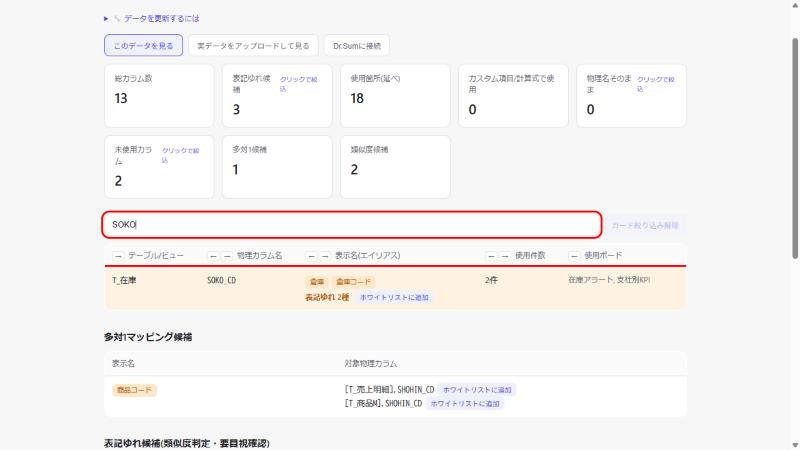
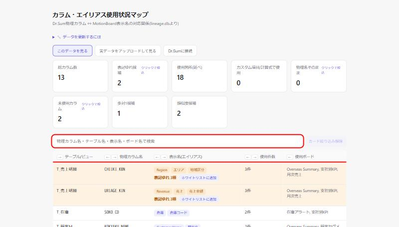
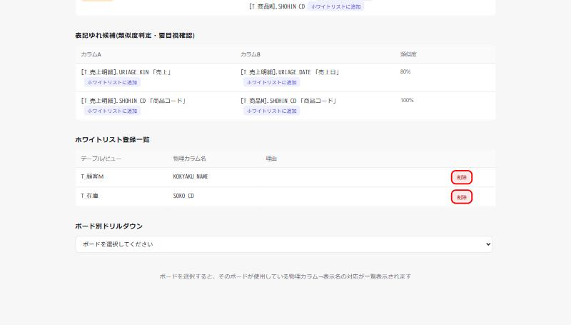
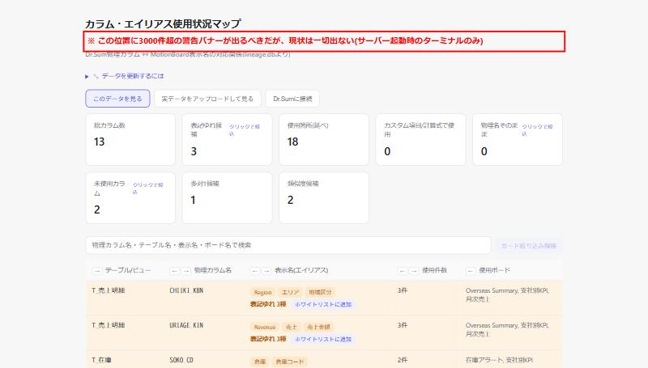
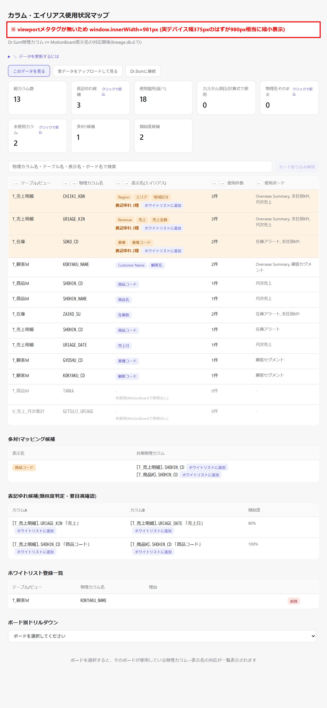

# DD-014 バグ再現レポート

確認日: 2026-10-02
環境: `web-viewer-demo`設定(`python web_viewer.py --db demo_data/lineage.db --port 8791`)、組み込みブラウザ（Playwright MCP未導入のため代替）

---

## Bug#1: ホワイトリスト登録・削除後に検索/絞り込み/ソート等の状態が消える

**現象**: 検索ボックスに「SOKO」と入力して1行に絞り込んだ状態で、その行を「ホワイトリストに追加」→登録すると、登録自体は成功する（`naming_whitelist.json`に追記される）が、ページ全体が`location.reload()`で再読込され、検索語が空になり13行全件表示に戻る。カード絞り込み・列ソート・列並び替え・ドリルダウン選択も同様に全リセットされる（コード上同じ`location.reload()`経路のため）。

| Before(検索で絞り込み中) | After(登録後に全リセット) |
|---|---|
|  |  |
| 検索語「SOKO」でSOKO_CD 1行に絞り込み済み | 登録完了後、検索語が空になり13行全件表示に戻っている |

**原因**: `web_viewer.py`の`submitWhitelistAdd`(L615-623)・削除ハンドラ(L964-972)が成功後に`location.reload()`を呼んでおり、検索欄の値・`activeCardFilter`・`sortColumn`/`sortDirection`・`columnOrder`・選択中ドリルダウンボードといったJS側の状態が全て初期化される。

---

## Bug#2: ホワイトリスト削除に確認ステップが無い

**現象**: ホワイトリスト登録一覧の「削除」ボタンはクリックした瞬間に`/api/whitelist/delete`へPOSTし、確認ダイアログや取り消し手段を挟まず即座に`naming_whitelist.json`から該当エントリを削除する。

- 赤枠: KOKYAKU_NAME・SOKO_CDそれぞれの「削除」ボタン。このボタンを押すだけで即削除される（確認UIが存在しない）。
- 実機検証: SOKO_CDの削除ボタンをクリック → `naming_whitelist.json`から即座に該当行が消えることを確認（確認ステップ・取り消し操作は一切発生しなかった）。

**原因**: `web_viewer.py`の削除ハンドラ(L964-972)が`confirm()`等を挟まず直接fetchしている。

---

## Bug#3: 3000件超の警告が画面上に表示されない

**現象**: `LARGE_DATASET_WARNING_THRESHOLD`(3000件)超過時の警告は`web_viewer.py`起動処理内の`print()`(L1116)でターミナル標準出力にのみ出力され、ブラウザ画面側には対応するDOM要素が存在しない。`document.body.innerText`に警告文言（「重くなる」）が含まれないことをJS実行で確認済み。`export_static.py`はこの判定ロジック自体を呼んでいないため、静的配布版では警告そのものが発生しない。

- 赤枠: 本来この位置（画面上部）に警告バナーが出るべきだが、現状は一切表示されない旨を注記として重ねて表示。

**原因**: 件数情報が画面側（`/api/columns`応答や`EMBEDDED_DATA`）に渡されておらず、警告表示用のUI・JSロジックが存在しない。

---

## Bug#4: viewportメタタグが無く、モバイルで縮小表示される

**現象**: モバイル幅(375×812相当)でページを開いても、`window.innerWidth`が375ではなく981になる。ブラウザがviewportメタタグの欠落をデスクトップページとみなし、980px相当のレイアウトとして描画してから縮小表示するため、実際のデバイス幅に応じたレイアウトにならない。

- 赤枠: `window.innerWidth=981px`であることを示す注記（本来375px前後になるべき）。

**原因**: `INDEX_HTML`の`<head>`に`<meta name="viewport" content="width=device-width, initial-scale=1">`が存在しない。

---

## 確認結果サマリー

| Bug# | 概要 | 再現 | エビデンス手段 | 備考 |
|------|------|------|--------------|------|
| 1 | ホワイトリスト登録・削除後に検索/絞り込み/ソート等の状態が消える | OK | キャプチャ（組み込みブラウザ） | 登録・削除どちらの経路でも再現 |
| 2 | ホワイトリスト削除に確認ステップが無い | OK | キャプチャ＋`naming_whitelist.json`の実変化 | 確認ダイアログは一切表示されなかった |
| 3 | 3000件超の警告が画面上に表示されない | OK（コード・DOM調査） | キャプチャ＋`document.body.innerText`調査 | デモデータが13件のため実際の閾値超過は未発生、コード・DOM上の不在で確認 |
| 4 | viewportメタタグが無く、モバイルで縮小表示される | OK | キャプチャ＋`window.innerWidth`実測 | 375指定時にinnerWidth=981を確認 |

テスト後、Phase 0で追加したホワイトリストエントリ（SOKO_CD）は削除済みで、`naming_whitelist.json`はDD着手前と同じ状態（KOKYAKU_NAMEのみ）に戻してある。
