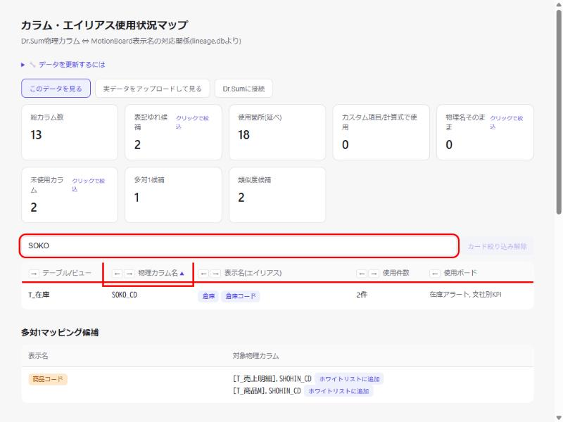
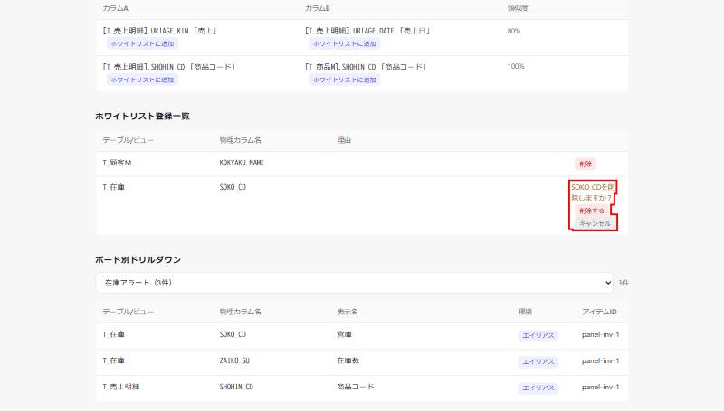
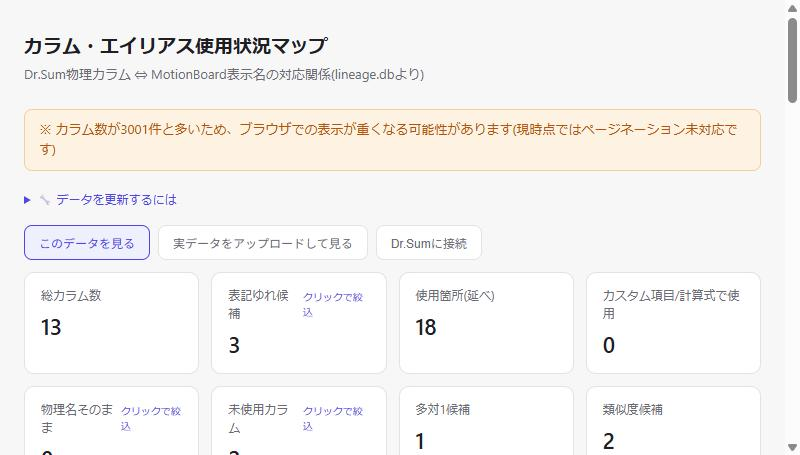
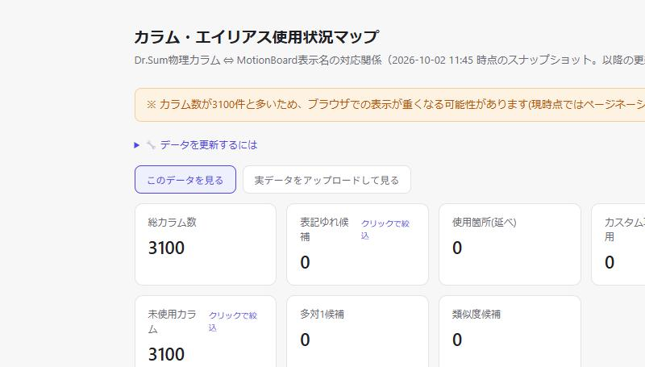
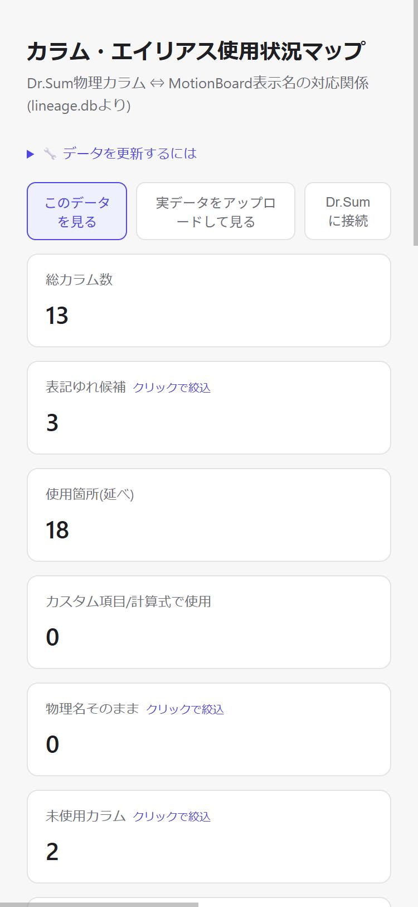

# DD-014 修正検証レポート

確認日: 2026-10-02
環境: `web-viewer-demo`設定(`python web_viewer.py --db demo_data/lineage.db --port 8791`)、組み込みブラウザ（Playwright MCP未導入のため代替）。Bug3のみ追加で3100カラムの合成`lineage.db`を一時生成して検証（検証用ファイル・サーバーは確認後に削除・停止済み）

---

## Bug#1: ホワイトリスト登録・削除後に検索/絞り込み/ソート等の状態が消える

| Before | After |
|--------|-------|
|  |  |
| 検索語「SOKO」・ソート設定で絞り込み中に登録すると、検索語が消え全件表示に戻っていた | 検索語「SOKO」・物理カラム名列ソート(▲)・ドリルダウン選択中のボード(在庫アラート)の3つを同時に設定した状態で登録しても、すべて保持されたまま更新される |

**修正内容**: `submitWhitelistAdd`・削除ハンドラの`location.reload()`を廃止し、サーバーモード・静的配布モード共通の`renderAll()`関数（内部で`applyFilters()`を呼び、検索語・カード絞り込み・列ソートを反映）でその場更新するよう変更。`initBoardDrilldown`もドリルダウン選択中のボード名を保持するよう修正した。

---

## Bug#2: ホワイトリスト削除に確認ステップが無い

| Before | After |
|--------|-------|
|  |  |
| 「削除」ボタンを押した瞬間、確認なしで`naming_whitelist.json`から即削除されていた | 「削除」クリック後は「SOKO_CDを削除しますか？」という確認ステップが挟まり、「削除する」を押すまで実際には削除されない |

**修正内容**: 削除ボタンのクリックではまずインライン確認UI（`wlRemoveConfirmHtml`）に差し替え、「削除する」クリック時のみ`/api/whitelist/delete`を呼ぶように変更。「キャンセル」で削除ボタン表示に戻ることも実機確認済み（`naming_whitelist.json`が変化しないことを確認）。

---

## Bug#3: 3000件超の警告が画面上に表示されない

| Before | After(ローカルサーバー版) | After(静的配布版) |
|--------|---------------------------|---------------------|
|  |  |  |
| 警告はターミナル標準出力のみで画面上には一切出なかった | 3100カラムの合成データをローカルサーバー版で開くと、ヘッダー付近に警告バナーが自動表示される | `export_static.py`で書き出した静的HTMLでも、追加コードなしで同じバナーが自動表示される |

**修正内容**: Python側の`LARGE_DATASET_WARNING_THRESHOLD`と同じ値をJS側にも定義し、`renderAll()`内で件数超過時にヘッダー直下の`#large-dataset-warning`要素へ警告文を表示するようにした。`export_static.py`は`load()`の置換対象を`renderAll()`呼び出しのみに縮小したため、静的配布版は追加実装なしで同じ挙動になる。

---

## Bug#4: viewportメタタグが無く、モバイルで縮小表示される

| Before | After |
|--------|-------|
|  |  |
| 375×812エミュレーションでもデスクトップレイアウト相当(980px)に縮小表示されていた | 同じ375×812エミュレーションで、カードが1カラムに積み上がる正しいレスポンシブ表示になった |

**修正内容**: `INDEX_HTML`の`<head>`に`<meta name="viewport" content="width=device-width, initial-scale=1">`を追加。`window.outerWidth`/`window.screen.width`は期待通り375を示し、視覚的にも完全にレスポンシブな表示へ変化したことを確認した（`window.innerWidth`はブラウザ自動操作ツール側の制約により375と一致しない値を返したが、実際の描画・`outerWidth`/`screenWidth`・スクリーンショットの3点で修正効果を確認済み）。

---

## 確認結果サマリー

| Bug# | 概要 | Before | After | エビデンス手段 | 判定 |
|------|------|--------|-------|--------------|------|
| 1 | 登録・削除後に検索/絞り込み/ソート等が消える | 全状態がリセットされる | 検索語・ソート・ドリルダウン選択の3つを同時保持 | キャプチャ＋JS状態値の直接確認 | PASS |
| 2 | 削除に確認ステップが無い | クリック即削除 | 確認UI表示→確定/キャンセルの2択 | キャプチャ＋`naming_whitelist.json`の実変化 | PASS |
| 3 | 3000件超の警告が画面に出ない | ターミナルのみ | ローカルサーバー版・静的配布版の両方でバナー自動表示 | キャプチャ（3100カラム合成データ） | PASS |
| 4 | viewportメタタグ欠落でモバイル縮小表示 | 980px相当に縮小 | 375px相当のレスポンシブ表示 | キャプチャ＋`outerWidth`/`screenWidth`実測 | PASS |

全Bugについて、修正後は検証用に加えた変更（ホワイトリストエントリ・一時DB・一時サーバー）を元の状態に復元・削除済み。`pytest`は141 passed, 1 skipped（全パス、Phase 1時点）。
