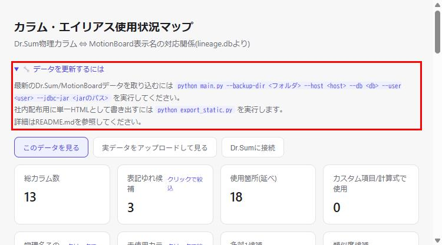
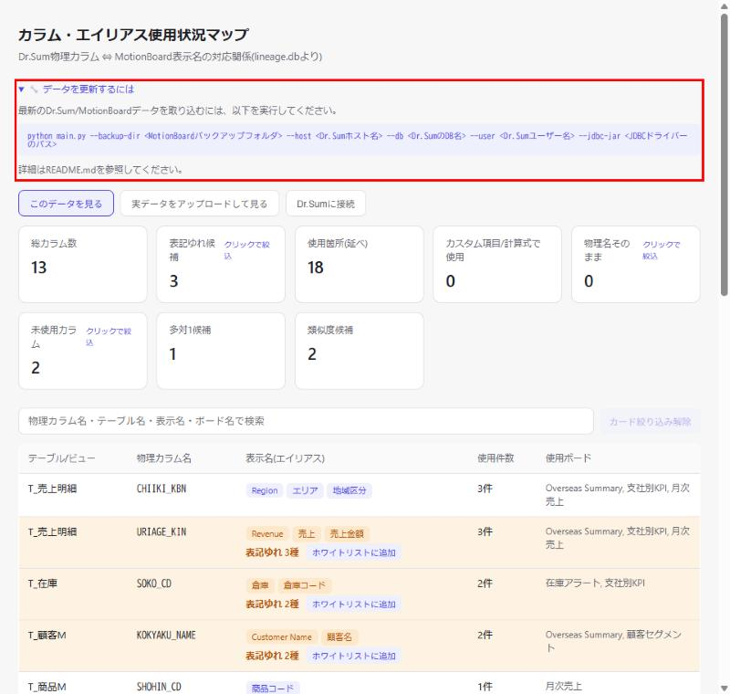

# DD-008: 更新用コマンドの画面内表示

| 作成日 | 更新日 | ステータス | 補足 |
|--------|--------|-----------|------|
| 2026-09-30 | 2026-09-30 | 完了 | コードブロック化・プレースホルダ具体化・export_static.py行削除を反映。pytest 141件パス |

> アプローチ: 標準（既存画面へのテキスト・折りたたみヒント追加のみで、新規画面や複雑なロジックを伴わないため）
> リスク: なし

## 目的

`web_viewer.py`の閲覧画面と、`export_static.py`が生成する静的HTMLのそれぞれに、
「このデータを更新・再生成するにはどのコマンドを打てばよいか」を画面内で確認できる
ヒント表示を追加するかどうかを決定する。

## 背景・課題

現状、`main.py`（データ取り込み）・`web_viewer.py --connect`（画面からのDr.Sum接続）・
`export_static.py`（静的HTML再生成）の実行コマンドはREADMEにのみ記載されている。

画面を見ている人（特に開発者以外にファイルを渡された先輩等）が「これを更新するには
何をすればいいか」を知りたくなった際、都度README.mdを開いて該当コマンドを探す必要があり、
手間になっている。

一方で、以下の設計上の配慮が必要:

- `export_static.py`の生成物（静的HTML）は「Python・コマンド操作不要でブラウザで開くだけ」
  を売りにした配布用フォーマット（README.md該当箇所参照）であり、CLIコマンドを前面に出すと
  かえって「Pythonが要るのでは」という誤解を招く懸念がある
- `web_viewer.py`は「Dr.Sumに接続」ボタン（DD-007）でCLI操作そのものを隠す設計になっており、
  生コマンドの併記は設計思想と方向性がずれる可能性がある

## 検討内容

| 選択肢 | 内容 | 長所 | 短所 |
|---|---|---|---|
| A | 何もしない（README参照のまま） | 実装コスト0。各画面の役割（コマンド不要 / ボタンでの隠蔽）を崩さない | 画面を見ている人がREADMEを探す手間は残る |
| B | 両画面にコマンド全文を常時表示 | 一目で分かる | 静的HTMLの「コマンド不要」という前提と矛盾。画面が煩雑になる |
| C | 両画面に折りたたみ式の「更新するには」ヒント（要点1〜2行＋README該当節へのリンク／パスの案内）を追加 | 普段は隠れており邪魔にならない。知りたい人だけ開ける | 折りたたみUIの実装が必要（小規模） |

## 決定事項

案C（折りたたみヒント）を採用する。

- 配置箇所: `web_viewer.py`の`INDEX_HTML`テンプレート内、`
...
`の直後（見出し直下・モード切替ボタンの手前）
  - `export_static.py`は`INDEX_HTML`をベースに文字列置換して生成するため、この1箇所の変更で両画面（ライブ閲覧・静的HTML）に反映される
- UI: `

🔧 データを更新するには
...
`形式。既定は閉じた状態
- 表示内容（要点2行＋README誘導。フルオプション一覧は書かない）:
  1. 最新データの取り込み: `python main.py --backup-dir <フォルダ> --host <host> --db <db> --user <user> --jdbc-jar <jarのパス>`
  2. 社内配布用の単一HTML書き出し: `python export_static.py`
  3. 「詳細はREADME.mdを参照してください」の一文
- スタイルは既存のCSS変数（`--text-sub`/`--accent`/`--accent-bg`）に合わせ、新規クラス`.update-hint`を追加

### 追記（2026-09-30 ユーザーFBによる修正）

初版実装後、以下3点のフィードバックを受け修正する。

1. コマンドをコピーしやすいよう、インラインの`<code>`から独立したコードブロック（`<pre><code>`）表示に変更する
2. 各プレースホルダに何を入れるべきか分かるよう、`<フォルダ>`等の抽象的な表記を`<MotionBoardバックアップフォルダ>` `<Dr.Sumホスト名>` `<Dr.SumのDB名>` `<Dr.Sumユーザー名>` `<JDBCドライバーのパス>`のように具体化する（`web_viewer.py`の「Dr.Sumに接続」フォームのラベル表記に合わせる）
3. 「社内配布用に単一HTMLとして書き出すには`python export_static.py`」の行を削除する（先輩への共有時点で既に静的HTMLを渡しており、画面内ヒントとしては本題（データ更新）から外れるため不要と判断）

## 受け入れ基準

（このDDが「完成した」と言える条件を、検証可能な形（操作 → 期待結果）で列挙する。
各基準は、いずれかの🔬機械検証・E2Eシナリオ・エビデンスと対応させること）

| # | 基準（操作 → 期待結果） | 検証方法 |
|---|------------------------|---------|
| 1 | 決定事項が確定している | ユーザーレビューでの合意（案C、後にFBで文言修正） |
| 2 | `web_viewer.py`起動時、見出し直下に「🔧 データを更新するには」の折りたたみが表示され、開くと`main.py`のコマンドがコードブロックでコピーしやすく表示され、プレースホルダから何を入れるか分かる | Phase 3 ブラウザ確認・エビデンス |
| 3 | `export_static.py`が生成する静的HTMLにも同じ内容が表示される（`export_static.py`自体の紹介行は含まない） | Phase 3 ブラウザ確認（`for_senpai_check.html`で確認） |
| 4 | 既存のpytestが壊れていない | 完了前チェックの全回帰 |

## エビデンス

| After（初版） | After（FB反映後） |
|--------------|-------------------|
|  |  |
| 折りたたみを開いた初版の状態 | コードブロック化・プレースホルダ具体化・export_static.py行削除後の状態（赤枠部分） |

## タスク一覧

### Phase 1: 方針確認
- [x] 選択肢A/B/Cのいずれかをユーザーと合意する → 案C
- [x] （Cの場合）表示するコマンド・文言・配置箇所を確定する → 「決定事項」参照
- [x] 🔬 機械検証: 本DDの「決定事項」セクションが空欄でなくなっていることを目視確認（コード変更を伴わないPhaseのため）

### Phase 2: 実装
- [x] `web_viewer.py`の`INDEX_HTML`に`.update-hint`のCSSと、`
`直後への`
`ブロックを追加
- [x] 🔬 機械検証: `pytest tests/test_web_viewer.py tests/test_export_static.py tests/test_similarity_port.py` → 25 passed, 1 skipped
- [x] `python web_viewer.py`と`python export_static.py`の両方でブラウザ確認し、折りたたみの開閉・表示コマンドの文言をスクリーンショットで確認

### Phase 3: 文言修正（ユーザーFB反映）
- [x] `web_viewer.py`の`.update-hint`内を`<pre><code>`によるコードブロック表示に変更し、`.update-hint pre`のCSSを追加
- [x] コマンド中のプレースホルダを`<MotionBoardバックアップフォルダ>` `<Dr.Sumホスト名>` `<Dr.SumのDB名>` `<Dr.Sumユーザー名>` `<JDBCドライバーのパス>`に具体化
- [x] 「社内配布用に単一HTMLとして書き出すには`python export_static.py`」の行を削除
- [x] 🔬 機械検証: `pytest tests/test_web_viewer.py tests/test_export_static.py tests/test_similarity_port.py` → 25 passed, 1 skipped
- [x] `python web_viewer.py`と`export_static.py`出力の両方でブラウザ確認し、コードブロック化・文言修正をスクリーンショットで確認

### 完了前チェック
- [x] 受け入れ基準を1項目ずつ照合（未達成があれば理由をログへ）→ 全4項目達成（基準2・3は修正後の文言・見た目で再確認）
- [x] 😈 セルフレビュー1巡（「どこが壊れるか」を探す。読み返す価値のある所見のみログへ。深掘りが要る場合の手法: doc/da-method.md）
- [x] 🔬 全回帰1回（`pytest` → 全パス）→ 141 passed, 1 skipped

## ログ

### 2026-09-30
- DD作成。先輩への動作確認共有時に「更新コマンドを画面上に出した方が親切では」という指摘から起票
- 案Cで合意。`web_viewer.py`の`INDEX_HTML`に折りたたみを実装（`export_static.py`は同テンプレート流用のため追加変更不要）
- 😈セルフレビュー: 表示コマンド内の`<フォルダ>`等のプレースホルダは`&lt;&gt;`でエスケープ済みでHTML崩れなし。既存テストとの衝突なし（全141件パス）。破壊的変更点なし
- pytest全141件パス、ブラウザ確認（`web_viewer.py`起動時・`export_static.py`出力の両方）完了。DD完了・アーカイブ
- ユーザーFB「コードブロックでコピーしやすく／プレースホルダに何のフォルダか分かるヒントを／社内配布の行は不要」を受け再オープン。`<pre><code>`化・プレースホルダ具体化（`<MotionBoardバックアップフォルダ>`等、connectフォームのラベル表記に合わせた）・`export_static.py`紹介行の削除を実施
- pytest全141件パス、ブラウザ確認（`web_viewer.py`・`export_static.py`出力の両方）再確認。DD再完了・再アーカイブ
