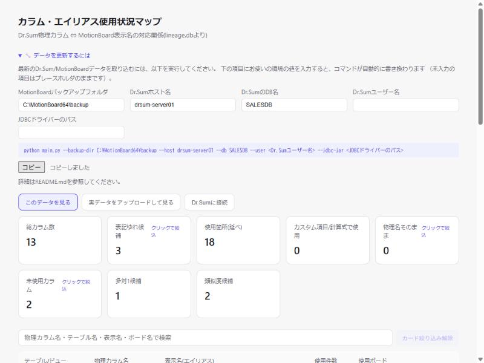
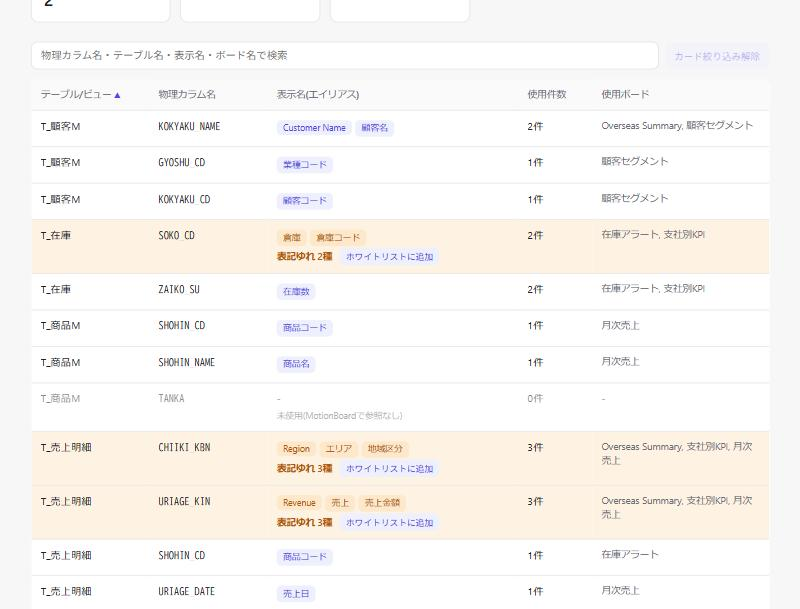

# DD-009: 先輩FB反映（コマンド入力補助・ホバー説明・列ソート）

| 作成日 | 更新日 | ステータス | 補足 |
|--------|--------|-----------|------|
| 2026-10-01 | 2026-10-01 | 完了 | 更新コマンド入力補助・ホバー説明(8枚中5種)・5列ソートを実装。pytest 141件パス |

> アプローチ: 標準（既存画面へのUI追加のみで、新規画面や複雑なビジネスロジックを伴わないため。DD-008と同方針）
> リスク: なし

## 目的

先輩への動作確認共有（`for_senpai_check.html`）で受けた3件のフィードバックを画面に反映する。

1. 更新コマンドの入力補助（DB名等のユーザー固有値をフォーム入力すればコマンドが自動生成される）
2. 表記ゆれ候補・類似度候補・未使用カラム等のホバー説明
3. テーブル/ビュー・物理カラム・表示名（エイリアス）列の並べ替え

## 背景・課題

- DD-008で画面内に更新コマンド（`python main.py --backup-dir <...> --host <...> ...`）を表示したが、
  プレースホルダ部分は依然としてユーザーが手でコピー→該当箇所を削除→自分の値を入力する必要があり、手間が残っている
- サマリーカード（表記ゆれ候補/類似度候補/未使用カラム等）やバッジは、初見のユーザーには項目名だけでは意味が伝わりにくい
- メインのカラム一覧テーブル（`id=tbody`、列はテーブル/ビュー・物理カラム名・表示名(エイリアス)・使用件数・使用ボード）は現状ソート機能がなく、SQLの固定順（`ORDER BY alias_count DESC, c.table_name, c.column_name`）でのみ表示される。定義ファイルの特定カラムが一覧のどこにあるか探しにくい

## 検討内容

| 項目 | 選択肢 | 採用 | 理由 |
|---|---|---|---|
| ①コマンド生成 | A: `connect-panel`の接続フォームを流用し共用化 / B: `.update-hint`内に専用の軽量フォームを新設 | B | 接続フォームはサーバーへのPOST送信が前提（DD-007）で目的が異なる。CLIコマンド文字列生成は静的HTML（Python不要配布）でも動く必要があり、JS内完結の軽量フォームが適切 |
| ①ホバー説明の見せ方 | A: カスタムツールチップUI実装 / B: ネイティブ`title`属性 | B | 要望は「ホバーで説明が出る」こと自体。`title`属性なら追加CSS/JS不要でブラウザ標準動作、過剰実装を避けられる |
| ③ソート実装 | A: 全5列（使用件数・使用ボードも含む）をソート可能に / B: FB記載の3列（テーブル/ビュー・物理カラム・表示名）のみ | A（ユーザーFBにより変更） | 当初Bで起票したが、「3列以外にも対応してほしい」とのFBを受け全列対応に変更 |

## 決定事項

### 1. 更新コマンド入力補助

`web_viewer.py`の`INDEX_HTML`内、既存の`.update-hint`（DD-008で追加した折りたたみ）に、5つのプレースホルダに対応する入力欄を追加する。

- 対象: `--backup-dir` `--host` `--db` `--user` `--jdbc-jar`（`main.py`の必須引数。`main.py:51-67`参照）
- 各`<input>`の`input`イベントで、下に表示される`<pre><code>`のコマンド文字列を再生成する（未入力の項目は元のプレースホルダ表記 `<Dr.Sumホスト名>` 等のまま残す。全部入力しなくても使える）
- 「コピー」ボタンでClipboard APIにより生成済みコマンドをコピー
- `export_static.py`は`INDEX_HTML`を文字列置換して生成するため、この1箇所の変更で両画面に反映される（DD-008と同じ構造）

### 2. ホバー説明

サマリーカード（`CARD_DEFS`が描画する全8枚のうち、下表の5種）・バッジ（`.badge.warn` `.badge.calc` `.badge.unaliased`）・警告/除外行（`tr.warn` `tr.orphan`）・関連テーブルの見出し（`<h2>多対1マッピング候補</h2>` `<h2>表記ゆれ候補(類似度判定・要目視確認)</h2>`）に、`title`属性で短い説明文を付与する。

| 対象 | 説明文（案） |
|---|---|
| 表記ゆれ候補カード/バッジ | 同じ物理カラムに表記の異なる表示名が複数使われている可能性がある項目です |
| 多対1候補カード/「多対1マッピング候補」見出し | 異なる物理カラムに同じ表示名が使われている候補です（意図的な使い回しか表記の混同かは目視確認が必要です） |
| 類似度候補カード/「表記ゆれ候補(類似度判定)」見出し | 文字列が似ている表示名の組を機械的に検出した候補です。実際に同一の意味かは目視確認が必要です |
| 未使用カラムカード/行（orphan） | どのMotionBoardボードからも参照されていない物理カラムです |
| 物理名そのままカード/バッジ | 表示名が設定されず物理カラム名のままMotionBoardで使われている項目です |

※起票時の初版では「多対1候補」と「類似度候補」を1行に混同して記載していたが、意味が異なる（多対1=異なる物理カラムに同じ表示名／類似度=表示名の文字列が似ている）ため実装時に2行へ分割した。

### 3. テーブル列の並べ替え

メイン一覧テーブル（`renderTable()`が描画する`<tbody id="tbody">`）の`<th>`全5列（テーブル/ビュー・物理カラム名・表示名(エイリアス)・使用件数・使用ボード）をクリックでソート可能にする。

- クリックで昇順→降順→初期順（SQL既定順）をトグル
- 現在のソート列・方向を`<th>`に矢印（▲/▼）で表示
- `applyFilters()`がフィルタ後の配列を`renderTable()`へ渡している箇所（`web_viewer.py`内`applyFilters()`）にソート処理を挟む
- 列ごとのソートキー（`fetchData`/`jsFetchData`が返す行オブジェクトのフィールドに対応。`web_viewer.py:384-397`参照）:
  | 列 | ソートキー |
  |---|---|
  | テーブル/ビュー | `table_name`（文字列比較） |
  | 物理カラム名 | `column_name`（文字列比較） |
  | 表示名(エイリアス) | `display_names`の先頭要素（文字列比較、アルファベット順。エイリアス未設定行は空文字扱いで末尾） |
  | 使用件数 | `usage_count`（数値比較） |
  | 使用ボード | `boards.length`（件数、数値比較。同数の場合は`boards`先頭要素の文字列比較） |

## 受け入れ基準

| # | 基準（操作 → 期待結果） | 検証方法 |
|---|------------------------|---------|
| 1 | 「🔧 データを更新するには」を開き、host/db/user等の入力欄に値を入れると、下のコマンド例がリアルタイムで該当プレースホルダだけ置き換わる。「コピー」で入力後の文字列がクリップボードにコピーされる | Phase 1 ブラウザ確認・エビデンス |
| 2 | サマリーカード（表記ゆれ候補/未使用カラム等）・バッジ・警告行にマウスオーバーすると、項目の意味を説明するツールチップが表示される | Phase 2 ブラウザ確認・エビデンス |
| 3 | メインテーブルの5列（テーブル/ビュー・物理カラム名・表示名(エイリアス)・使用件数・使用ボード）いずれかの見出しをクリックすると、その列基準で昇順/降順に並べ替わり、矢印で現在の並び順が分かる | Phase 3 ブラウザ確認・エビデンス |
| 4 | 既存のpytestが壊れていない | 完了前チェックの全回帰 |

## エビデンス

| Phase | スクリーンショット | 説明 |
|---|---|---|
| 1 |  | ホスト名・DB名等を入力し、コマンドが自動生成され「コピーしました」が表示された状態 |
| 2 | （上記スクリーンショットの下部に写る8枚のサマリーカード） | ネイティブ`title`ツールチップは画面キャプチャに写らないため、ブラウザJSで各要素の`title`属性値を読み取り、決定事項の説明文と一致することを確認した（スクリーンショットではなくDOM検証でのエビデンス） |
| 3 |  | 「テーブル/ビュー」見出しをクリックし昇順ソート（矢印▲表示、T_顧客M→T_在庫→T_商品M→T_売上明細の順）になった状態 |

## タスク一覧

### Phase 1: 更新コマンド入力補助
- [x] `web_viewer.py`の`.update-hint`内に、backup-dir/host/db/user/jdbc-jarの5つの`<input>`とコピー用ボタンを追加
- [x] 対応するJS（入力に応じてコマンド文字列を再生成する関数、クリップボードコピー処理）を追加
- [x] 🔬 機械検証: `pytest tests/test_web_viewer.py tests/test_export_static.py` → 25 passed, 1 skipped
- [x] `python web_viewer.py`をブラウザで確認し、入力→コマンド生成→コピーの一連の操作をスクリーンショットで記録（Before/After不要、新規UIのため追加後のみ）

### Phase 2: ホバー説明
- [x] `CARD_DEFS`の各カード要素、バッジ要素（`.badge.warn` `.badge.calc` `.badge.unaliased`）、`tr.warn`/`tr.orphan`行、関連テーブル見出しに`title`属性で説明文を付与
- [x] 🔬 機械検証: `pytest tests/test_web_viewer.py` → 17 passed
- [x] ブラウザでカード・バッジにマウスオーバーし、説明文が表示されることを確認（ネイティブ`title`ツールチップはスクリーンショットに写らないため、DOM上の`title`属性値をJSで読み取って内容を確認）

### Phase 3: テーブル列ソート
- [x] メインテーブルの5つの`<th>`すべてにクリックハンドラとソートアイコン表示を追加
- [x] `applyFilters()`にソート処理（現在のソート列・方向の状態を保持し、`renderTable()`呼び出し前に列ごとのソートキーで配列をソート。キー定義は「決定事項 3.」の表を参照）を追加
- [x] 🔬 機械検証: `pytest tests/test_web_viewer.py` → 17 passed
- [x] ブラウザで5列それぞれをクリックし、昇順/降順/初期順の切り替わりをスクリーンショットで記録

### 完了前チェック
- [x] 受け入れ基準を1項目ずつ照合（未達成があれば理由をログへ）
- [x] 😈 セルフレビュー1巡（「どこが壊れるか」を探す。読み返す価値のある所見のみログへ。深掘りが要る場合の手法: doc/da-method.md）
- [x] 🔬 全回帰1回（`pytest` → 全パス）

## ログ

### 2026-10-01
- DD作成。先輩への動作確認共有で受けた3件のFB（更新コマンドの入力補助／ホバー説明／列ソート）を起票
- Playwright MCP 未導入: エビデンスは内蔵ブラウザ（Claude Browser）での手動キャプチャで代替
- 仕様確認時、ユーザーより「列ソートは3列以外にも対応してほしい」とFB。対象を5列全部（使用件数・使用ボード含む）に変更し、列ごとのソートキーを決定事項に明記
- ユーザーより「ロードマップなどのドキュメントを訂正してから」実装するよう指示。調査の結果、本DDとは別件で以下3点の既存ドキュメント不整合を発見・修正（実装着手前の前提整備）:
  1. `doc/operation/operations.md`: 履歴ファイル名を固定の`run_history.json`と誤記していた箇所を、実際の`match_aliases.py --history-file`の既定値（`<db>.history.json`、既定`lineage.db.history.json`）に修正
  2. `README.md`: `sample_data/`のテスト対象ファイル数を「12ファイル全件」と誤記していた箇所を、実際の構成（XML12・JSON4・ZIP1の全17ファイル）に修正
  3. `doc/guide/user-guide.md`: README.mdへのアンカーリンク`#事前準備dr-sumへの実接続に必要なもの`がGitHubのスラッグ生成規則（`.`は除去されハイフンに変換されない）と不一致でリンク切れだったため`#事前準備drsumへの実接続に必要なもの`に修正
  - 併せて本DD自身の記述誤り（「`CARD_DEFS`が描画する4枚」→実際は全8枚中4種）も修正
  - `bash scripts/doc-check.sh`・`pytest`（141 passed, 1 skipped）とも修正後に再確認
- Phase 1〜3を実装。`web_viewer.py`の`INDEX_HTML`（CSS/HTML/JS）を変更し、`export_static.py`は無改修（`INDEX_HTML`の文字列置換で両画面に反映される既存構造のため）
- 設計段階の誤り1点を実装中に発見・修正: 決定事項2.で「多対1候補」と「類似度候補」を1行に混同していたが、意味が異なるため2行に分割（「決定事項 2.」参照）
- built-in browserで`python web_viewer.py --db demo_data/lineage.db`を操作し確認:
  1. コマンド入力補助: backup-dir/host/dbを入力→コマンドがリアルタイムで該当箇所だけ置き換わることを確認。「コピー」クリックで「コピーしました」表示を確認
  2. ホバー説明: ネイティブ`title`属性はスクリーンショットに写らないため、JSで対象要素（カード5種・バッジ3種・h2見出し2箇所・警告行2種）の`title`値を取得し、決定事項の説明文と一致することを確認
  3. 列ソート: `column_name`列で3回クリック→昇順(▲、CHIIKI_KBN→GETSUJI_URIAGE→...）→降順(▼、ZAIKO_SU→URIAGE_KIN→...)→初期順(矢印消灯、SQL既定順に復帰)を確認。`display_name`列でエイリアス未設定行(`-`)が常に末尾に来ることを確認。`usage_count`/`boards`列も昇順・降順が数値通りに動くことを確認
- 😈 セルフレビューで発見・修正: モード切替（実データ表示→デモ表示に戻す）・実データアップロード読み込み・Dr.Sum接続成功後のいずれも、ソート列をクリックした状態のままデータを再読み込みすると、矢印表示は残るのに新データは未ソート（SQL既定順）のまま、という状態不整合を発見。`handleLoadUploaded`・`mode-demo-btn`クリック・`do-connect-btn`クリックの3箇所（いずれも`export_static.py`が文字列置換する`load()`本体の外側）で`sortColumn = null; updateSortIndicators();`を呼ぶよう修正し、built-in browserで「ソート→モード切替→矢印が消えることを確認」まで再検証した
- `pytest`（141 passed, 1 skipped）、`export_static.py`出力の目視・機械確認（`EMBEDDED_DATA`埋め込み・新規UI要素の存在）とも最終確認済み。受け入れ基準4件すべて達成。DD完了・アーカイブへ
