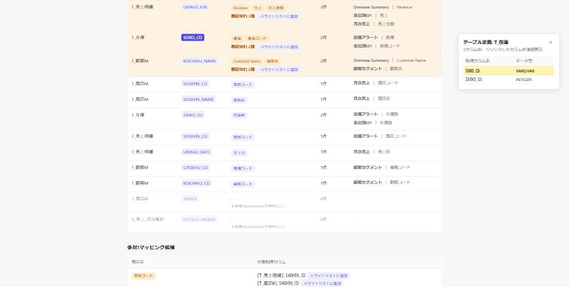
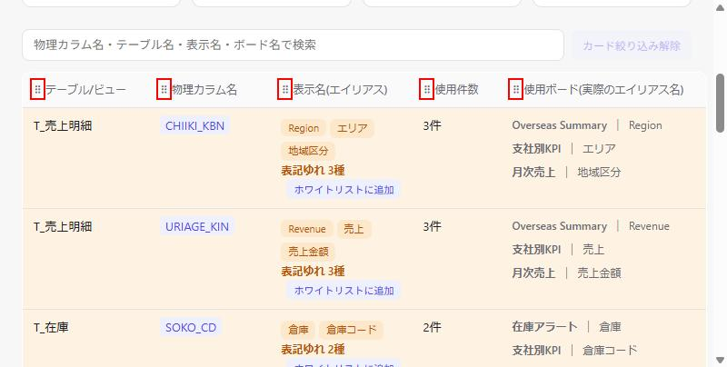

# DD-020: メイン一覧の操作性改善3件

| 作成日 | 更新日 | ステータス | 補足 |
|--------|--------|-----------|------|
| 2026-10-05 | 2026-10-05 | 完了 | 3件とも実機確認・受け入れ基準達成。verification/V001仕様書更新済み |

> アプローチ: モック先行（メイン一覧テーブルの見た目・操作感を大幅に変更するため。guides.md §1）
> リスク: なし（認可・認証／DBスキーマ／外部I/F／機密情報・決済のいずれにも該当しない）

## 目的

メイン一覧テーブル（V001画面）に対する利用者からの改善要望3件を実装し、カラム定義の参照しやすさ・列の並び替えやすさ・使用ボードとエイリアスの対応の見やすさを改善する。

## 背景・課題

利用者から以下3点の指摘があった。

1. 物理カラム名をクリックしても何も起きない。そのカラムが属するテーブルに他にどんなカラムがあるか（テーブル定義）をその場で確認できない
2. 列（テーブル/ビュー・物理カラム名・使用ボード等）の表示順入れ替えが`←`/`→`ボタンのみ（`web_viewer.py`内`renderTableHeader`/`moveColumn`、DD-009 Phase3・4で実装）で、離れた位置へ動かす際に何度もクリックが必要で直感的でない
3. 「使用ボード」列が`ボード名(表示名1/表示名2)`という1行詰め込み表示（`renderBoardsCell`、DD-016/DD-018）のため、どのボードにどの表示名が使われているかが読み取りにくいというフィードバックがあった

## 検討内容

### 論点1: テーブル定義の表示位置・強調方法

- ユーザー指定: 「テーブル定義は横の空いているスペースに出るようにして」
- 現在の画面は`.wrap`（`max-width: 980px`、中央寄せ）の外側に余白がある。この余白にサイドパネルとして表示する
- データソース: `allRows`（画面内に既にロード済みの全カラムデータ）から同一`table_name`の行を抽出すれば追加API不要
- 強調方法: パネル内でクリック元の物理カラムの行に背景色を付けて強調する
- 画面幅が狭くサイドスペースが無い場合（モバイル等、DD-014でviewport対応済み）のフォールバックが必要 → モックで提示し確認

### 論点2: 列の並び替え手段

- ドラッグ操作に統一する。既存の`←`/`→`ボタンは廃止する（ユーザーレビューで指示。モックで提示した「ボタン残置」案は不採用）
- 列見出し(`<th>`)をドラッグ可能にし、ドロップ位置に応じて`columnOrder`を並び替える

### 論点3: 使用ボード列の表示形式

- ユーザー指定の表示形式に変更:
  ```
  該当ボードA | 表示名（エイリアス）
                表示名（エイリアス）
                表示名（エイリアス）
  該当ボードB | 表示名（エイリアス）
  ```
- 現行の`formatBoard`（`/`区切りで1行結合）をやめ、ボード名1行目＋表示名を複数行に分けて表示する
- 計算式使用分（`計算式: xxx`）の扱い、省略表示（先頭3件+他N件、DD-018）の扱いは現行踏襲でモックに反映し、レビューで確認する

## 決定事項

- 論点1（テーブル定義サイドパネル）・論点3（使用ボード列の新表示形式）: モック提示どおりの方針で合意
- 論点2（列の並び替え手段）: ドラッグ操作に統一し、既存の`←`/`→`ボタンは廃止する（モックでのユーザーレビューで指示）

## 受け入れ基準

| # | 基準（操作 → 期待結果） | 検証方法 |
|---|------------------------|---------|
| 1 | メイン一覧で物理カラム名をクリックする → 画面の空いているスペース（サイドパネル）に該当テーブルの全カラム定義が表示され、クリックしたカラムの行が色付けされて強調される | Phase3 E2Eシナリオ#1 |
| 2 | 列見出しをドラッグして別の位置にドロップする → 列の表示順がドロップ位置に入れ替わる。`←`/`→`ボタンは画面上に存在しない | Phase3 E2Eシナリオ#2 |
| 3 | 複数ボード・複数表示名を持つ物理カラムの行を見る → 「使用ボード」列がボード名を1行目、同ボードの表示名をその下に複数行で表示する形式になっている | Phase3 E2Eシナリオ#3 |

## エビデンス

| 論点1: テーブル定義サイドパネル | 論点2・3: ドラッグハンドル＋使用ボード新表示形式 |
|---|---|
|  |  |
| SOKO_CDをクリックし、右の空きスペースにT_在庫のテーブル定義（SOKO_CD/ZAIKO_SU）が開き、クリックした行が黄色で強調されている | 各列見出しに⠿ドラッグハンドル（赤枠は確認用）。「使用ボード」列は「ボード名｜表示名」形式で、同ボードの追加表示名・計算式は下に重ねて表示 |

新規開発（既存UIの置き換えを含む）のためAfterのみ。

## タスク一覧

### Phase 1: HTMLモック作成

- [x] 🎨 **HTMLモック作成**（`DD-020/mock/index.html`）
  - サンプルデータでテーブル定義サイドパネル・列ドラッグ並び替え・使用ボード列の新表示形式を再現
  - 狭幅時のサイドパネルのフォールバック表示も含める
- [x] 👀 **ユーザーレビュー**（モックをユーザーに提示しレイアウト・操作感について合意を得る。合意を得てから次のPhaseへ進む。ゲート）— 「既存の←ボタンは省いてください」のFBを受け、列並び替えをドラッグのみに統一する方針で合意

### Phase 2: 実装
- [x] `web_viewer.py`: 物理カラム名クリック時にテーブル定義サイドパネルを表示する処理を追加（`allRows`から同一`table_name`を抽出、クリック行を強調。`openTableDefPanel`/`positionTableDefPanel`）
- [x] `web_viewer.py`: `renderTableHeader`を置き換え、列見出しのドラッグ並び替えのみにする（`moveColumn`・既存`←`/`→`ボタンは削除）
- [x] `web_viewer.py`（`renderBoardsCell`）: 使用ボード列をボード名＋表示名複数行の形式に変更
- [x] `web_viewer.py`（`fetch_data`）・`jsFetchData`: テーブル定義パネルにデータ型を表示するため`c.data_type`をSELECT・返却データに追加
- [x] `export_static.py`: 上記変更が静的配布版でも同じ置換ロジックで反映されることを確認（`renderAll()`呼び出しのみの置換のため追加対応不要。実機で確認済み）
- [x] 🔬 機械検証: `pytest` → 143 passed, 1 skipped（`data_type`追加のテスト1件を新規追加）

### Phase 3: E2E検証・ドキュメント整備
- [x] 🧪 実機確認（受け入れ基準1〜3。組み込みブラウザでサーバーモード・静的配布版の両方を確認）
- [x] 📸 エビデンス取得（`DD-020/maintable-after-table-def-panel.png`＝論点1、`DD-020/maintable-after-drag-handles-and-boards-format.png`＝論点2・3。新規機能のためAfterのみ）
- [x] `doc/spec/V001_カラムエイリアス使用状況ビューア.md`更新（主要UI要素・実装仕様・コード位置参照・ビジネスルール・変更ログ、`related_dds`にDD-020追加）
- [x] 🔬 機械検証: `bash scripts/doc-check.sh` → OK

### 完了前チェック
- [x] 受け入れ基準を1項目ずつ照合（未達成があれば理由をログへ）
- [x] 😈 セルフレビュー1巡（「どこが壊れるか」を探す。読み返す価値のある所見のみログへ）
- [x] 🔬 全回帰1回: `pytest && bash scripts/doc-check.sh` → 全パス

## ログ

### 2026-10-05
- DD作成。ユーザーから3件の改善要望（カラム名クリックでのテーブル定義表示・列並び替えのドラッグ操作化・使用ボード列の表示形式変更）を受けて起票
- Playwright MCP 未導入: エビデンスは組み込みブラウザ（`mcp__Claude_Browser__*`）でのキャプチャで代替
- モック（`DD-020/mock/index.html`）作成・組み込みブラウザで3論点すべての動作を確認（テーブル定義パネルのハイライト表示、←/→ボタンでの列入替、ドラッグ用ハンドルの表示、新しいボード表示形式）
- ユーザーレビュー: 「既存の←ボタンは省いてください」とのFBを受け、論点2を「ドラッグ操作に統一し`←`/`→`ボタンは廃止」に変更してモック・DD本体を更新。モック再確認し、以後Phase2実装に着手

### 2026-10-05（Phase 2）
- `web_viewer.py`を修正。①`MAIN_COLUMN_DEFS.column_name`のセルを`.col-link`リンクに変更し`openTableDefPanel`/`positionTableDefPanel`でサイドパネル（横空きスペース優先、狭ければ`#table-def-inline-anchor`へインライン）を実装、②`renderTableHeader`から←/→ボタンを削除しHTML5ドラッグ&ドロップ(`reorderColumn`)に一本化、③`renderBoardsCell`を「ボード名｜表示名」＋重ね表示形式に変更
- テーブル定義パネルにデータ型を表示するため、`fetch_data`（Python）・`jsFetchData`（ブラウザ内sql.js）双方のSELECTに`c.data_type`を追加。`export_static.py`は`fetch_data`・`renderAll()`をそのまま再利用するため追加変更不要（DD-014の集約設計により影響範囲が小さく済んだ）
- `tests/test_web_viewer.py`に`data_type`がレスポンスに含まれることを検証するテストを1件追加
- 🔬 `pytest` → 143 passed, 1 skipped（全パス、新規追加分含む）

### 2026-10-05（Phase 3）
- `web-viewer-demo`（デモデータ）で実機確認: ①SOKO_CDクリックでT_在庫のテーブル定義パネルが開きSOKO_CD行がハイライトされる（横幅1700pxで右空きスペースに固定表示、1280px/375px相当では一覧下にインライン表示を確認）、②ドラッグ&ドロップ（`DragEvent`合成）で列順が入れ替わり←/→ボタンがDOM上に存在しないこと、③使用ボード列が「ボード名｜表示名」形式で複数表示名が重ね表示されることを確認
- `export_static.py`で静的書き出し版を生成し、同じ3点を実機確認（`STATIC_EXPORT=true`環境でも`data_type`付きでテーブル定義パネルが機能することを確認）。検証用の一時出力ファイルは確認後に削除済み
- 📸 エビデンス2枚を`DD-020/`に配置（`maintable-after-table-def-panel.png`、`maintable-after-drag-handles-and-boards-format.png`）
- [V001仕様書](../spec/V001_カラムエイリアス使用状況ビューア.md)を更新（ビジネスルール・主要UI要素・実装仕様のコード位置参照・主要ビジネスロジック位置・変更ログ、`related_dds`にDD-020追加。併せてDD-020の変更で行番号がずれた既存参照（`_require_db`等）も実測値に更新）
- `bash scripts/doc-check.sh` → OK

### 2026-10-05（完了前チェック）
- 受け入れ基準#1〜3を1項目ずつ再照合し、いずれも実機確認で達成を確認
- 😈 セルフレビュー: (1) ホワイトリスト登録・削除でメイン一覧が再描画されるとテーブル定義パネルは開いたまま内容が更新されない（表示中のテーブル定義自体は変わらないため実害は小さいが、該当カラムが削除された場合は古い情報のまま残る）→ 受け入れ基準に含まれない軽微な既知挙動としてログに記録し、今回は対応範囲外とした。(2) `position:fixed`のサイドパネルが十分な余白判定(`340px`)未満で画面下にインライン表示されるフォールバックは、モックと同じ閾値・ロジックで実装されており、実機（1280px/1700px）でも想定どおり動作することを確認済み
- 🔬 全回帰: `pytest` → 143 passed, 1 skipped、`bash scripts/doc-check.sh` → OK
