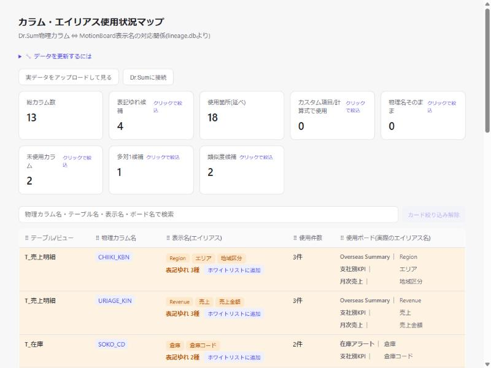
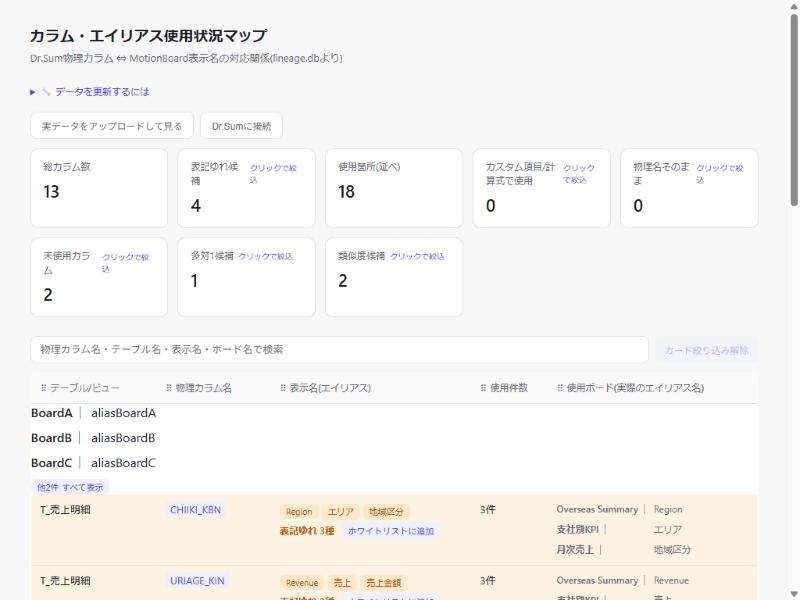
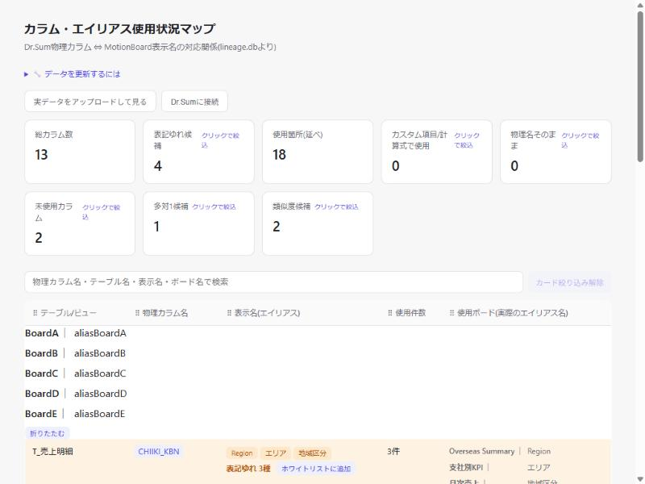
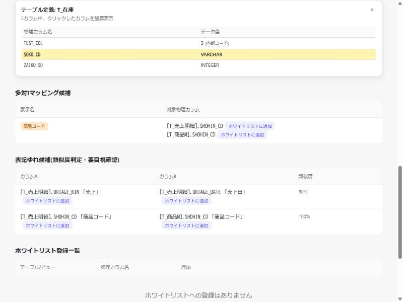

# DD-021: ビューア表示の改善3件

| 作成日 | 更新日 | ステータス | 補足 |
|--------|--------|-----------|------|
| 2026-10-06 | 2026-10-06 | 完了 | 3件とも実機確認・受け入れ基準達成。V001仕様書更新済み |

> アプローチ: 標準（探索的実装。既存表示の小規模な見やすさ改善3件で、新規画面や大幅な見た目変更を伴わないためモック先行は不要。guides.md §1）
> リスク: なし（認可・認証／DBスキーマ・マイグレーション／外部I/F／機密情報・決済のいずれにも該当しない）

## 目的

メイン一覧（V001画面）の「使用ボード(実際のエイリアス名)」欄の見やすさと、テーブル定義パネルの「データ型」欄の分かりやすさを改善する。

## 背景・課題

ユーザーから以下3点の指摘があった。

1. 「使用ボード(実際のエイリアス名)」欄で、複数ボードが縦に並ぶ場合、ボード名の文字数が異なるため区切り線(｜)や表示名リストの開始位置が行ごとにずれ、見づらい（`web_viewer.py`の`renderBoardGroup`/`renderBoardsCell`、`.board-name`はflexの可変幅）
2. 同欄で4件以上のボードがある場合に表示される「他N件」（`renderBoardsCell`のrestItem、DD-018/DD-020踏襲）は、ホバー(`title`属性)でしか全件を確認できず、全表示・省略表示を能動的に切り替える手段がない
3. テーブル定義パネルの「データ型」列（`TABLE_DEF_COLUMNS`/`data_type`）は、デモデータでは`VARCHAR`等の文字列だが、実機のDr.Sum環境では`__all_tables__.column_type`が内部数値コード（例: `0`,`3`,`7`等）のまま返り、そのままdata_typeに格納・表示されるため、ユーザーには何の型か分からない

## 検討内容

### 論点1: ボード名の表示位置ずれ

- 原因: `.board-row`が`display:flex`で、`.board-name`の幅がテキスト長に依存するため、同一セル内で複数ボードを縦に並べたときに区切り線より後の位置が揃わない
- 対応: セル全体（`renderBoardsCell`が返すラッパー要素）を`display:grid; grid-template-columns: max-content auto`に変更し、`.board-group`/`.board-row`を`display:contents`にして子要素（ボード名・区切り線・表示名リスト）を直接グリッドアイテム化する。これによりセル内の全ボード行でボード名列の幅が最長のボード名に揃い、区切り線・表示名リストの開始位置が一致する
- 影響範囲はCSSと`renderBoardGroup`のクラス構成のみで、DOM構造・データは変更しない

### 論点2: 「他N件」の全表示・省略表示切り替え

- 対応: 「他N件」をクリック可能なボタン（既存の`.badge`相当の見た目のミニボタン）にし、クリックで残りのボード一覧（非表示で保持済みの要素）を表示/非表示に切り替える。ボタン文言を「他N件 すべて表示」⇄「折りたたむ」で切り替える
- 既存の`title`属性による全件ホバー表示は維持する（併用可）
- クリックハンドラは既存の`document.getElementById('tbody').addEventListener('click', ...)`（`.col-link`等を処理している委譲ハンドラ）に相乗りさせ、新規のグローバルリスナーは追加しない

### 論点3: データ型が数値コードのまま表示される（要確認事項）

- 過去の決定（[D-004](../decisions.md)、[DD-002-2](../archived/DD/DD-002-2_Dr.Sum実環境対応.md)）で、`column_type`の数値コード→型名の対応表は実機確認が取れなかったため**未確認のままスコープ外**とし、数値をそのまま`data_type`に格納する方針が確定している。調査メモに`VARCHAR系=0、DATE系=3、REAL/NUMERIC系=7`という推測はあるが「未確認」と明記されており、裏付けのない対応表を今採用すると誤った型名を表示するリスクがある
- 本DDでは、ユーザーからの確認待ちの間に実装を止めないため、**対応表を使った型名変換は行わず**、数値コードの横に説明ラベル/ツールチップ（例: 「(Dr.Sum内部コード。型名への変換は未対応)」）を追加し、「何の数字か分からない」状態を解消する方向で着手する
- 実機での対応表が確認できた場合は、別DDで型名変換を追加する（D-004の決定を変更する場合は`doc/decisions.md`の更新も伴う）

## 決定事項

- 論点1: 使用ボード欄のセルをCSS Grid化し、ボード名列の幅を揃える
- 論点2: 「他N件」をクリックで全表示/省略表示を切り替えられるボタンにする（ホバーでの全件表示は維持）
- 論点3: 対応表が未確認のため型名への変換は今回見送り、数値コードが「Dr.Sum内部コード」であることを示す説明ラベルを追加するところまでを本DDのスコープとする（型名変換は対応表確認後に別DDで対応）

## 受け入れ基準

| # | 基準（操作 → 期待結果） | 検証方法 |
|---|------------------------|---------|
| 1 | 4件以上のボードに使われている物理カラムの行を見る → 「使用ボード」欄で全ボード行のボード名列の幅が揃い、区切り線・表示名の開始位置が一致している | Phase 2 実機確認#1 |
| 2 | 同欄で「他N件」をクリックする → 隠れていた残りのボードが表示され、ボタン文言が「折りたたむ」に変わる。再度クリックすると元の省略表示に戻る | Phase 2 実機確認#2 |
| 3 | 物理カラム名をクリックしてテーブル定義パネルを開く → 「データ型」列の数値コードの横（またはホバー）に、それがDr.Sum内部コードであり型名への変換が未対応である旨の説明が表示される | Phase 2 実機確認#3 |

## エビデンス

| 論点1: ボード名列の整列 | 論点2: 「他N件」トグル（省略時→全表示） | 論点3: データ型の内部コード注記 |
|---|---|---|
|  |  →  |  |
| CHIIKI_KBN行: Overseas Summary/支社別KPI/月次売上の3ボードで区切り線(｜)以降の表示名開始位置が揃っている | 動作確認のため一時的に5ボード分のデータを注入。「他2件 すべて表示」クリックで残り2ボードが展開され、ボタンが「折りたたむ」に変化（再クリックで元に戻ることも確認済み） | TEST_COL行に数値データ型`3`を一時注入し、「3 (内部コード)」の注記とホバー説明が表示されることを確認。実データのVARCHAR/INTEGER行は注記なしのまま |

既存UIの改修のためBefore相当は省略し、変更箇所が分かるAfterのみを掲載（論点2はデモデータに4件以上ボードを持つ行が無いため、組み込みブラウザのJS実行で一時的にテスト用データを注入して動作確認）。

## タスク一覧

### Phase 1: 実装
- [x] `web_viewer.py`: `.boards`セル・`.board-group`・`.board-row`のCSSを`display:grid`/`display:contents`に変更し、`renderBoardGroup`/`renderBoardsCell`のクラス構成を調整してボード名列の幅を揃える（論点1）
- [x] `web_viewer.py`: `renderBoardsCell`の「他N件」をトグルボタン化し、残りのボード一覧を非表示要素として保持して表示/非表示を切り替える処理を追加（論点2。既存の`tbody`クリック委譲ハンドラに追加）
- [x] `web_viewer.py`: テーブル定義パネルの「データ型」セルに、数値コード（非VARCHAR等の非文字列値）の場合の説明ラベル/ツールチップを追加（論点3。`formatDataType`関数を新設）
- [x] `export_static.py`: 上記変更が静的配布版でも同じ置換ロジックで反映されることを確認（`export_static.py`でデモデータを書き出し、ローカルHTTPサーバーで配信して`STATIC_EXPORT:true`・`.board-cell`描画・`formatDataType`の存在を実機確認。追加対応不要と確認できた）
- [x] 🔬 機械検証: `pytest` → 143 passed, 1 skipped（全パス。既存テストのみで新規追加なし。正規表現の無効エスケープ警告が出たため`\\d`に修正）

### Phase 2: 実機確認・ドキュメント整備
- [x] 🧪 実機確認（受け入れ基準1〜3。組み込みブラウザでサーバーモード・静的配布版の両方を確認）
- [x] 📸 エビデンス取得（`DD-021/`に配置）
- [x] `doc/spec/V001_カラムエイリアス使用状況ビューア.md`更新（ビジネスルール・主要UI要素・主要ビジネスロジック位置のコード位置参照、`related_dds`にDD-021追加、変更ログ追記）
- [x] 🔬 機械検証: `bash scripts/doc-check.sh` → OK

### 完了前チェック
- [x] 受け入れ基準を1項目ずつ照合（未達成があれば理由をログへ）
- [x] 😈 セルフレビュー1巡（「どこが壊れるか」を探す。読み返す価値のある所見のみログへ）
- [x] 🔬 全回帰1回: `pytest && bash scripts/doc-check.sh` → 全パス

## ログ

### 2026-10-06
- DD作成。ユーザーから3件の表示改善要望（使用ボード欄のボード名位置ずれ・「他N件」の全表示/省略表示切り替え・テーブル定義のデータ型数値コード問題）を受けて起票
- 論点3（データ型の数値コード→型名変換）はD-004/DD-002-2で対応表が未確認と記録されているため、今回は型名変換を見送り説明ラベル追加までをスコープとする方針とした。ユーザーへの確認質問を送ったが応答前にセッションが中断したため、誤った型名を表示するリスクを避ける安全側の方針（ラベル追加のみ）を既定案として採用し、実装後にユーザーへ方針を明示して修正要望があれば別途対応する

### 2026-10-06（Phase 1）
- `web_viewer.py`を修正。①`.board-cell`をCSS Grid（`grid-template-columns: max-content auto`）化し`.board-group`を`display:contents`にしてボード名列の幅を揃え、`renderBoardGroup`はボード名＋区切り線を1グリッドアイテムにまとめるよう変更、②`renderBoardsCell`で4件目以降を`.board-list-rest`（既定で`board-list-collapsed`付与）として保持し、「他N件 すべて表示」⇄「折りたたむ」の`.board-list-toggle`ボタンを追加、③`formatDataType`関数を新設し、`data_type`が数値文字列のみの場合に`.type-code-note`（「(内部コード)」+ホバー説明）を付与するよう`openTableDefPanel`を修正
- 正規表現`/^-?\d+$/`をPython非raw文字列内にそのまま書いたところ`SyntaxWarning: invalid escape sequence '\d'`が発生（`doc/spec/V001...`の過去トラブル#5と同根のPython/JS間エスケープ問題）。`\\d`に修正して解消
- `export_static.py`でデモデータ（`demo_data/lineage.db`）を静的HTMLに書き出し、ローカルHTTPサーバーで配信して組み込みブラウザで確認。`STATIC_EXPORT:true`・`.board-cell`が11件描画・`formatDataType`が関数として存在することを確認し、追加のコード変更は不要と判断
- 🔬 `pytest` → 143 passed, 1 skipped（全パス）

### 2026-10-06（Phase 2）
- `web-viewer-demo`設定（デモデータ）で実機確認: ①CHIIKI_KBN等、3ボードが使われる行でボード名列の幅・区切り線位置が揃うことを確認、②デモデータには4件以上のボードを持つ行が無いため、組み込みブラウザのJS実行で5ボード分のデータを一時注入し「他2件 すべて表示」クリックで展開→「折りたたむ」クリックで収納の往復動作を確認、③テーブル定義パネルで数値データ型`3`を一時注入し「3 (内部コード)」の注記とホバー説明を確認（実データのVARCHAR/INTEGERは注記なしのまま）。注入したテスト用DOM要素はいずれも確認後にページ再読込で除去済み
- 📸 エビデンス4枚を`DD-021/`に配置
- [V001仕様書](../spec/V001_カラムエイリアス使用状況ビューア.md)を更新（ビジネスルール表・主要UI要素・主要ビジネスロジック位置のコード参照、`related_dds`にDD-021追加、変更ログ追記）
- `bash scripts/doc-check.sh` → OK

### 2026-10-06（完了前チェック）
- 受け入れ基準#1〜3を1項目ずつ再照合し、いずれも実機確認で達成を確認
- 😈 セルフレビュー: (1) ホワイトリスト登録・削除後に`renderAll`が再描画されると「他N件」トグルの展開状態はリセットされ常に省略表示に戻る。ただし元の実装もトグル機能自体が無かったため既存挙動からの後退ではなく、今回のスコープ外として許容。(2) `.board-list-toggle`クリック時に親の`title`属性（全件ホバー表示）のツールチップも同時に出る可能性があるが、情報としては矛盾しないため実害なし。(3) `formatDataType`の数値判定は前後の空白を`trim()`してから正規表現判定するが、表示自体は元の文字列をそのまま`escapeHtml`しているため、万一DB側に前後空白を含む値があると注記の直前に空白が残る可能性がある。実データでは想定されにくく、発生しても見た目のみの軽微な影響のため対応は見送り
- 🔬 全回帰: `pytest` → 143 passed, 1 skipped、`bash scripts/doc-check.sh` → OK
