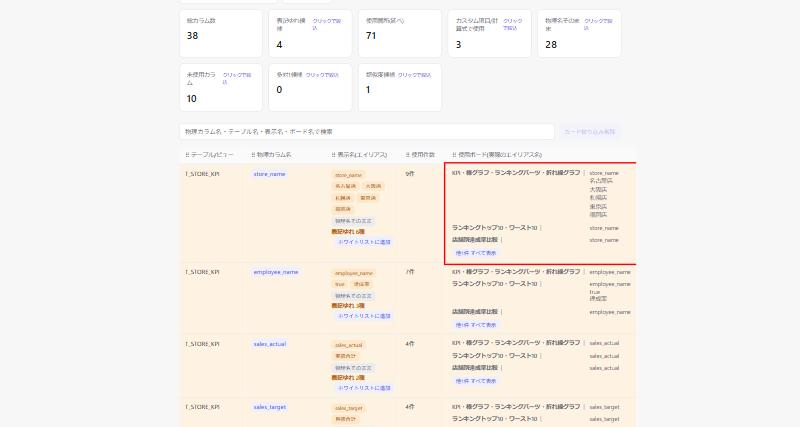
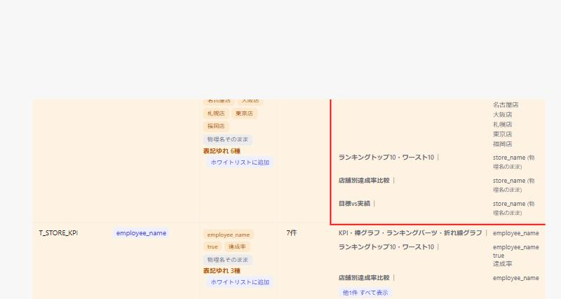
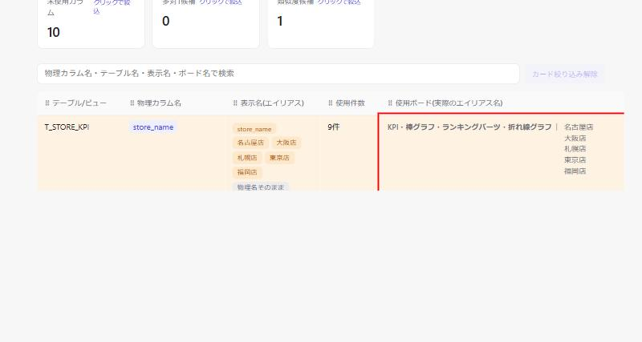

# DD-022: 使用ボード欄の物理名そのまま表示をエイリアスと誤認させない対応

| 作成日 | 更新日 | ステータス | 補足 |
|--------|--------|-----------|------|
| 2026-10-06 | 2026-10-06 | 完了 | 案A実装済み。物理名のまま使用は「(物理名のまま)」付記で区別 |

> アプローチ: バグ修正・フルパス（メイン一覧の画面表示に影響するため。guides.md §1）
> エビデンス: 画面キャプチャ（Playwright MCP。UI表示の不具合のため）
> リスク: なし（認可・認証／DBスキーマ／外部I/F／機密情報・決済のいずれにも該当しない）

## 概要

| Bug# | 概要 | 重要度 |
|------|------|--------|
| 1 | メイン一覧の「使用ボード(実際のエイリアス名)」欄が、MotionBoard上でエイリアス(表示名の上書き)が一切設定されず物理カラム名をそのまま使っているボードについても、物理名を本物のエイリアスと見分けがつかない形で表示してしまう |

## 原因分析

[board_parser.py:246-253](../../board_parser.py#L246-L253) の`_parse_drsum_datasource`で、MotionBoardの`aliasTitle`属性(ユーザーが表示名を上書きした場合のみ非空)が空のとき`display_name=alias_title or title`により物理カラム名(`title`)がそのまま`display_name`に入る。`usage_type`も常に`"alias"`固定で、「本当にエイリアスが命名された」ケースと「物理名をそのまま使っているだけ」のケースを区別する情報が`AliasRecord`に残らない。

`web_viewer.py`の「表示名(エイリアス)」列は[is_unaliased](../../web_viewer.py#L502)判定(物理カラム単位で、いずれかの表示名が物理名と正規化一致するか)を持ち「物理名そのまま」バッジ([web_viewer.py:852](../../web_viewer.py#L852))で区別しているが、「使用ボード」列の`renderBoardsCell`/`renderBoardGroup`([web_viewer.py:878-917](../../web_viewer.py#L878-L917))はボードごとの`display_name`をこの判定なしにそのまま列挙するため、物理名そのまま使っているボードと本当にエイリアスを命名したボードが画面上で区別できない。

## 検討内容

「使用ボード」欄で物理名そのまま使用のエントリをどう扱うか、2案を比較する。実例（`T_STORE_KPI.store_name`。KPI・棒グラフ・ランキングパーツ・折れ線グラフ板は店舗別エイリアス併用、他3板は物理名のまま）でA/B双方のキャプチャを取得し比較した。

| 案 | 内容 | メリット | デメリット |
|----|------|---------|-----------|
| A | 物理名そのまま分も表示し、印をつける（「表示名(エイリアス)」列の「物理名そのまま」バッジと同じ考え方。グレー表示+「(物理名のまま)」を付記） | どのボードが物理名のままかの情報が維持される（4板とも一覧に残る） | 列の情報量が増える（1物理カラムあたりの行数は変わらない） |
| B | 物理名そのまま分は欄から除外する | 見出し「実際のエイリアス名」の言葉どおりの中身になり、紛れがなくなる | 「どのボードが物理名のまま使っているか」の情報が欄から消える（実例では4板中3板が欄から丸ごと消える。データ自体は「表示名(エイリアス)」列の「物理名そのまま」バッジで別途わかる） |

## 決定事項

案A採用。物理名そのまま使用のエントリも「使用ボード」欄に表示し続け、グレー表示+「(物理名のまま)」付記で本物のエイリアスと区別する。

## エビデンス（Phase 0: 修正前・案A/B比較）

| Before（バグ現状） | 案A（印をつける） | 案B（欄から除外） |
|---|---|---|
|  |  |  |
| `store_name`列。KPI板・ランキングトップ10板・店舗別達成率比較板・目標vs実績板のすべてで「store_name」が本物のエイリアス（名古屋店/大阪店等）と区別なく並ぶ | 物理名のまま使用分はグレー+「(物理名のまま)」付記。4板すべてが一覧に残る | 物理名のまま使用のみの3板（ランキングトップ10・店舗別達成率比較・目標vs実績）が欄から消え、KPI板の店舗別エイリアスのみ残る |

## 受け入れ基準

| # | 基準（操作 → 期待結果） | 検証方法 |
|---|------------------------|---------|
| 1 | MotionBoard上でエイリアスを設定していない(物理名そのまま)ボードを含む物理カラムの行を見る → 「使用ボード」欄で、物理名そのまま使用のボードと本当にエイリアスを命名したボードが区別できる（決定事項に従った表示になっている） | Phase2 E2Eシナリオ#1 |

## タスク一覧

### Phase 0: 調査・再現確認・修正前エビデンス

- [x] コードベース調査 — 原因箇所の特定、影響範囲の把握（本DD起票時に完了。上記「原因分析」参照）
- [x] 環境起動（`python web_viewer.py --db lineage.db` を `.claude/launch.json` の `web-viewer-root` 構成で起動）
- [x] バグが発生している状態を確認（`T_STORE_KPI.store_name`。4板中3板が物理名のまま使用）
- [x] 📸 修正前エビデンス取得 → `DD-022/bug022-before-boards-column-unaliased.jpg`
- [x] 📸 案A・案Bの比較キャプチャ取得（組み込みブラウザでJS一時パッチして双方の見え方を再現。実装前のレイアウト合意用）→ `DD-022/bug022-variantA-marked-unaliased.jpg` / `DD-022/bug022-variantB-excluded-unaliased.jpg`
- [x] 👀 **ユーザーレビュー** — バグ再現・原因分析・検討内容(案A/B)の合意（ゲート）→ 案Aで合意

### Phase 1: コード修正・テスト
- [x] 決定事項に従い `web_viewer.py` を修正（`renderBoardGroup`に物理名判定を追加。詳細はログ参照。`board_parser.py`側の変更は不要と判明）
- [x] 同根パターンの横展開確認（`auto_parse_xml`/`auto_parse_json`は`AliasRecord`を生成するのみで表示整形は行わないため、本バグの対象は`web_viewer.py`の描画ロジックのみと確認）
- [x] `tests/test_web_viewer.py` 等にテスト追加・更新（JS描画ロジックのため既存どおり実機確認で検証。Python側のテスト対象変更なし）
- [x] 🔬 機械検証: `pytest` → 145 passed, 1 skipped、全パス

### Phase 2: 修正後エビデンス・ドキュメント整備
- [x] 📸 修正後エビデンス取得（Phase 0と同じ手段）→ `DD-022/bug022-after-variantA-applied.jpg` / `DD-022/bug022-after-real-alias-not-marked.jpg`
- [x] `doc/spec/V001_カラムエイリアス使用状況ビューア.md` 更新（該当する場合）→ 表示ロジックの内部変更のみのため不要と判断
- [x] 🔬 機械検証: `bash scripts/doc-check.sh` → OK

### 完了前チェック
- [x] 受け入れ基準を1項目ずつ照合（#1: 実機確認で達成。物理名のまま使用は「(物理名のまま)」付き、本物のエイリアスは無印で区別できることを確認）
- [x] 😈 セルフレビュー1巡（所見: DD-023修正前にこのDDだけ適用すると、DD-023由来の架空エイリアスにも「(物理名のまま)」が付かず無印のまま誤って「本物のエイリアス」に見えてしまう余地があった。今回は両DDを同時に実装・実機確認したため実害なし。将来再発しないよう、DD-023側の原因分析にも横展開した）
- [x] 🔬 全回帰1回: `pytest && bash scripts/doc-check.sh` → 全パス

## ログ

### 2026-10-06
- ユーザーから「使用ボード(実際のエイリアス名)欄で、実際にはエイリアスが命名されていないのに表示されているのではないか」という疑問を受けて調査。`aliasTitle`空(物理名そのまま使用)のケースで`display_name`に物理名が入り、「表示名(エイリアス)」列にある`is_unaliased`判定が「使用ボード」列には適用されていないことを特定。DD-022として起票
- ユーザーから「案A・案Bどちらのキャプチャも見て判断したい」との要望を受け、`.claude/launch.json`に実データ(`lineage.db`)を見る`web-viewer-root`構成を追加して組み込みブラウザで起動。実例`T_STORE_KPI.store_name`(4板中3板が物理名のまま使用、KPI板は店舗別の値も併用)を使い、ソースコードは変更せず組み込みブラウザ上でJSを一時パッチして案A(グレー+「(物理名のまま)」付記)・案B(物理名のまま使用のみの板は欄から除外)それぞれの見え方を再現してキャプチャ。Before含め3枚を`DD-022/`に配置
- ユーザーレビューの結果、案Aで合意
- ⚠️ 訂正: ユーザーからの追加質問を受けて実機(`C:\MotionBoard64`)のボード本体XMLを直接確認したところ、KPI板で「店舗別エイリアス」と見えていた「名古屋店/大阪店/札幌店/東京店/福岡店」は実はSTORE_NAME列の本物のエイリアス(aliasTitle)ではなく、`<Condition><SearchCondition><PreCondition><Expression title="store_name" dispTitle="大阪店" .../>`という**店舗別タブの事前設定フィルタ条件のキャプション**を`board_parser.py`の汎用ヒューリスティックが誤ってエイリアスとして抽出したものだった(別バグ。[DD-023](DD-023_検索条件のdispTitleをカラムのエイリアスと誤認する不具合.md)として分離して起票)。したがって本DDのエビデンス画像にある「KPI板の店舗別エイリアス」は実際には存在しないエイリアスであり、DD-023修正後は表示から消える見込み。本DD(DD-022)が対象とする「物理名そのまま使用を本物のエイリアスと区別できない」問題自体はSTORE_NAME列全体(6データソース全件がaliasTitle空)で引き続き該当するため、DD-022のスコープ・決定(案A)に変更はない
- Phase1実装: `web_viewer.py`の`renderBoardGroup(name, entry)`に第3引数`physicalName`を追加し、`normalizeText(表示名) === normalizeText(physicalName)`なら`.unaliased`クラス+「(物理名のまま)」を付記するよう変更。`renderBoardsCell`の3箇所の呼び出し(`details.length===0`時のフォールバック・先頭3件・「他N件」展開分)すべてに`r.column_name`を渡すよう修正。CSS(`.alias-line.unaliased`・`.unaliased-tag`)を追加。`export_static.py`は`renderAll()`をそのまま再利用するため追加変更不要(DD-020と同様の理由)
- 🔬 `pytest` → 145 passed, 1 skipped（全パス、変化なし。本Phaseはweb_viewer.pyのJS変更のみでPythonテスト対象外のため）
- 🧪 実機確認: 実データ(`C:\MotionBoard64`)から`board_parser.py`/`match_aliases.py`を再実行して`lineage.db`を再生成(DD-023の修正も同時に反映)し、組み込みブラウザで`T_STORE_KPI.store_name`を確認。4板すべてで`store_name (物理名のまま)`とグレー表示され、本物のエイリアスを持つ`sales_target`列の`目標vs実績`板(表示名「目標合計」)はタグなしで表示されることを確認(誤判定なし)
- 📸 修正後エビデンス取得 → `DD-022/bug022-after-variantA-applied.jpg`(4板とも物理名のまま表示)・`DD-022/bug022-after-real-alias-not-marked.jpg`(本物のエイリアスは無印のまま)
- V001仕様書は「使用ボード」欄の表示ロジックの内部変更のみで、UI要素・項目の追加は無いため更新不要と判断
