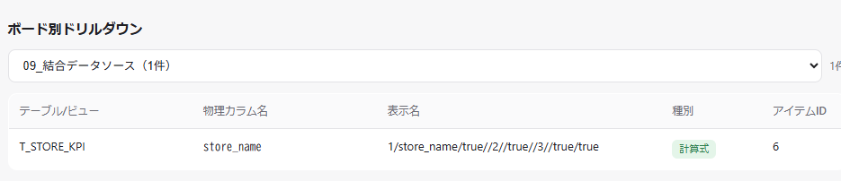

# DD-030 バグ再現レポート

確認日: 2026-10-08
環境: `DATALIZER_PRACTICE`接続。ボード別ドリルダウンでボード`09_結合データソース`を選択

---

## Bug#001: 結合データソースの構造的属性値が計算式の表示名として誤表示される

**現象**: ボード別ドリルダウンで`09_結合データソース`を選択すると、`T_STORE_KPI.store_name`の
表示名が`1/store_name/true//2//true//3//true/true`という意味不明な文字列になっている
(ユーザー報告のスクリーンショットより)。

### 画面キャプチャ:

- テーブル/ビュー: `T_STORE_KPI`、物理カラム名: `store_name`
- 表示名: `1/store_name/true//2//true//3//true/true` ← 本来期待されるのは人間が読める表示名(ラベル)
- 種別: 計算式、アイテムID: 6

原因分析: [cause-analysis.md](cause-analysis.md)

---

## 確認結果サマリー

| Bug# | 概要 | 再現 | エビデンス手段 | 備考 |
|------|------|------|--------------|------|
| 001 | 結合データソースの構造的シリアライズ値が計算式の表示名として誤表示される | OK(ユーザー報告のスクリーンショットで確認。実機の生XMLは未入手のため、修正検証は`board_aliases.json`実データ＋合成フィクスチャのユニットテストで行う) | キャプチャ＋テスト | |
