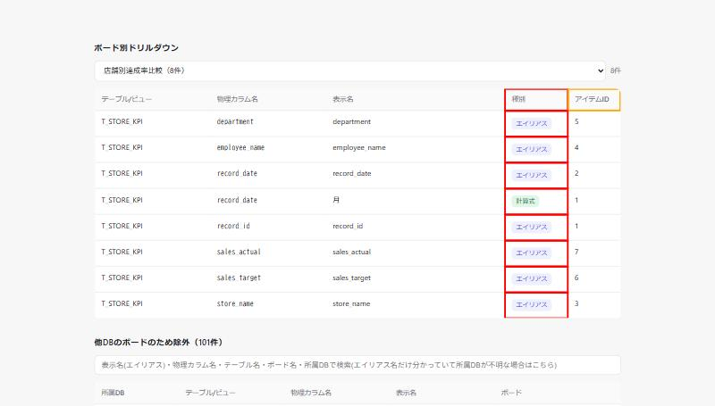

# DD-032 バグ再現レポート

確認日: 2026-10-08
環境: `python web_viewer.py --db lineage.db`（`.claude/launch.json`の`web-viewer-root`構成）で起動し、
ボード別ドリルダウンで`店舗別達成率比較`を選択

---

## Bug#001: ボード別ドリルダウンで「物理名のまま使用」を本物のエイリアスと区別できない

**現象**: メイン一覧では`department`/`employee_name`/`record_date`/`record_id`/`sales_actual`/
`sales_target`/`store_name`のすべてに「物理名そのまま」バッジが付いている（表示名が物理カラム名と
同じ＝MotionBoard上でエイリアスを設定していない）。しかしボード別ドリルダウンの「種別」列では、
これらすべてが無印の「計算式」ではない方＝「エイリアス」バッジとして表示され、本当にエイリアスが
命名されている行と区別がつかない。

### 画面キャプチャ:

- 赤枠: 「種別」列。8行中7行が物理名のまま使用(`department`→`department`等、表示名が物理カラム名と
  同一)にも関わらず、すべて緑色の「エイリアス」バッジで表示されている
- オレンジ枠: 「アイテムID」列。次のBug#002参照

---

## Bug#002: 「アイテムID」列の意味が画面上で説明されていない

**現象**: 「種別」「アイテムID」列にホバー説明が無く、特に「アイテムID」が何を指す値か
画面から読み取れない（上記キャプチャのオレンジ枠）。

原因分析: [cause-analysis.md](cause-analysis.md)

---

## 確認結果サマリー

| Bug# | 概要 | 再現 | エビデンス手段 | 備考 |
|------|------|------|--------------|------|
| 001 | ドリルダウンで物理名のまま使用がエイリアスと区別できない | OK | キャプチャ | `店舗別達成率比較`で8行中7行が該当 |
| 002 | 種別・アイテムID列の意味が未説明 | OK | キャプチャ | ホバー説明(title属性)が無い |
