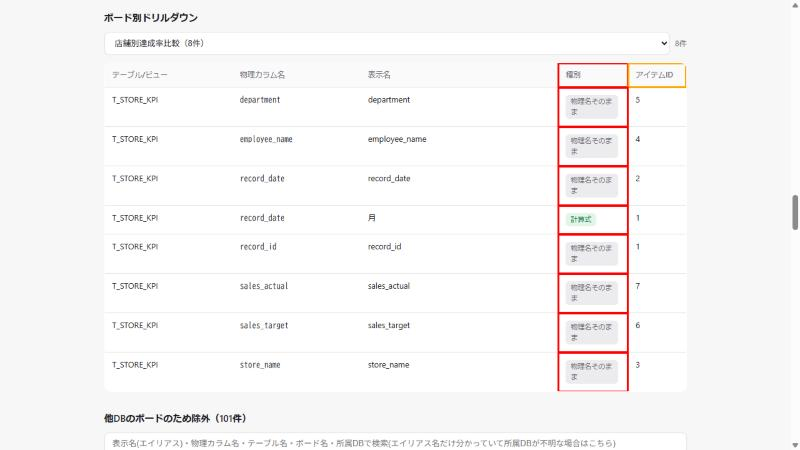

# DD-032 修正検証レポート

確認日: 2026-10-08
環境: `python web_viewer.py --db lineage.db`（`web-viewer-root`構成）で起動し、
ボード別ドリルダウンで`店舗別達成率比較`を選択

---

## Bug#001: ボード別ドリルダウンで「物理名のまま使用」を本物のエイリアスと区別できない

### 画面キャプチャの場合:
| Before | After |
|--------|-------|
|  |  |
| 8行中7行が物理名のまま使用にも関わらず、すべて緑色の「エイリアス」バッジ | 7行は灰色の「物理名そのまま」バッジ、1行（`record_date`→`月`）は「計算式」バッジで区別される |

**修正内容**: `web_viewer.py`に`drilldownUsageBadge(d)`を追加し、`usage_type==='alias'`でも
`normalizeText(表示名) === normalizeText(物理カラム名)`なら、メイン一覧の「使用ボード」欄
(DD-022)と同じ`.badge.unaliased`スタイル・文言「物理名そのまま」で表示するようにした。

---

## Bug#002: 「アイテムID」列の意味が画面上で説明されていない

### テスト出力(DOM確認。ネイティブtitleツールチップはOSレベルの描画でスクリーンショットに
写らないため、`title`属性の値をJavaScriptで直接確認した):
```
$ドリルダウン見出しのtitle属性(javascript_tool経由):
種別: 「エイリアス」=表示名がMotionBoard上で設定されている／「物理名そのまま」=表示名が設定されず
      物理カラム名がそのまま使われている／「計算式」=カスタム項目・事後計算項目の計算式の中で
      この物理カラムが参照されている
アイテムID: ボード定義ファイル内でこの項目を識別する内部ID(デバッグ・問い合わせ用の補助情報です。
            画面上のパーツ番号ではありません)
```

**修正内容**: `drilldown-table`の`<th>種別</th>`・`<th>アイテムID</th>`に`title`属性を追加した。

---

## 回帰確認

```
$ pytest -q（全回帰）
226 passed, 1 skipped in 3.26s
```

Python側のテスト対象はJS描画ロジックの変更の影響を受けないため、件数・結果に変化なし
（DD-022のPhase1と同様の理由）。

---

## 確認結果サマリー

| Bug# | 概要 | Before | After | エビデンス手段 | 判定 |
|------|------|--------|-------|--------------|------|
| 001 | ドリルダウンで物理名のまま使用がエイリアスと区別できない | 全行「エイリアス」バッジ | 物理名のまま使用は「物理名そのまま」バッジで区別 | 画面キャプチャ | PASS |
| 002 | 種別・アイテムID列の意味が未説明 | title属性なし | title属性で説明文を表示 | DOM確認(javascript_tool) | PASS |
