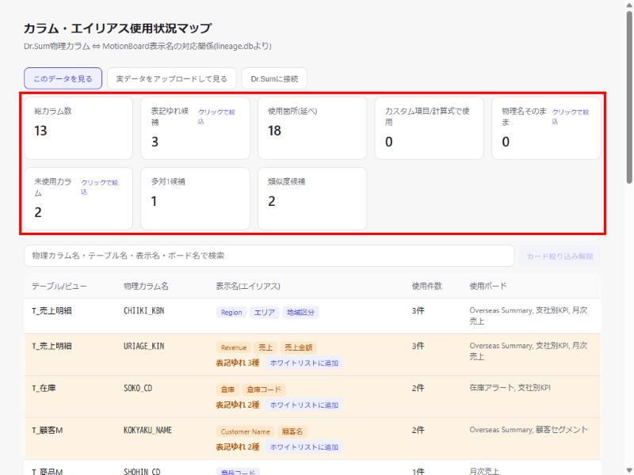
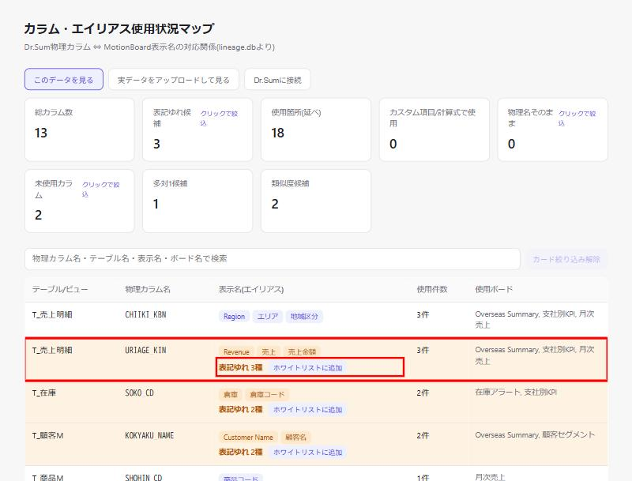
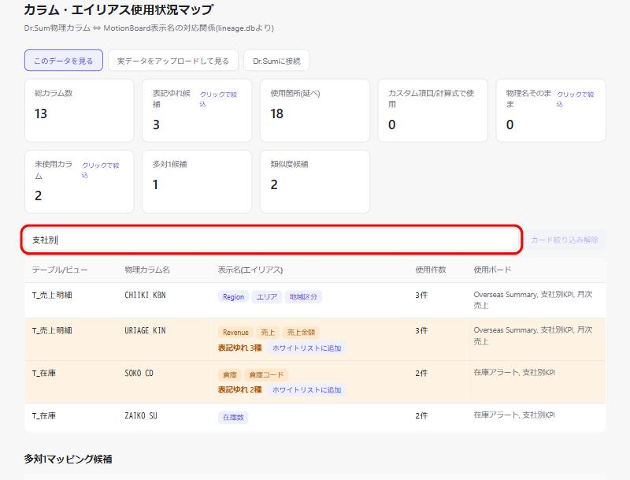
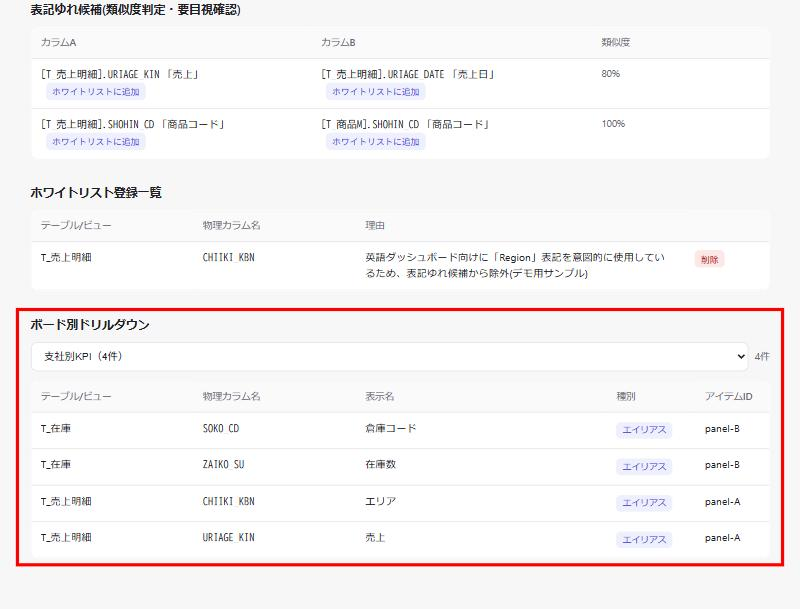
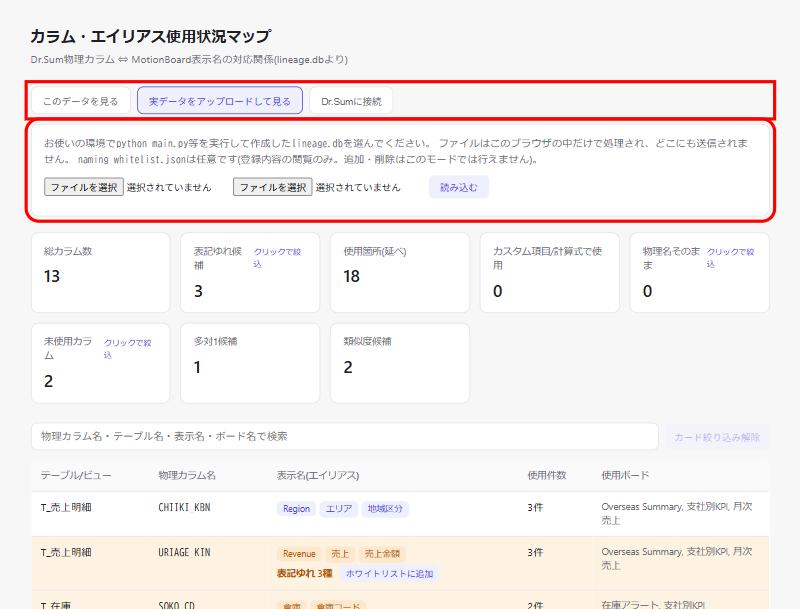

# 利用ガイド

> **対象読者**: このツールを操作する人全員。Dr.Sum/MotionBoardの専門用語に詳しくなくても
> 読み進められるように、共通の物差し（用語・画面キャプチャ）で説明しています。
>
> コマンドの全オプション・エラーメッセージ対応などの正確な仕様は
> [`../../README.md`](../../README.md) を参照してください。本ガイドはその「地図」として、
> 何のためのツールで、どこから読み始めればよいかを案内します。

## 1. このツールは何をするもの？

一言でいうと、**「Dr.Sumの本当のカラム名が、MotionBoardの画面上では何という名前で
表示されているか」を一覧にして見せてくれるツール**です。

たとえ話: 社内に「社員番号」という正式名称があるのに、部署によって「ID」「社員コード」
「スタッフNo」とバラバラに呼んでいたら混乱しますよね。データベースの世界でも同じことが
起きます。Dr.Sum上では`URIAGE_KIN`という1つの物理カラムなのに、MotionBoardの画面Aでは
「売上金額」、画面Bでは「Revenue」、画面Cでは「売上」と、担当者ごとに違う表示名を
付けてしまう——これが「表記ゆれ」です。このツールは、この表記ゆれを自動で見つけ出し、
ブラウザで一覧確認できるようにします。

## 2. 覚えておきたい用語

| 用語 | 意味 |
|------|------|
| **Dr.Sum** | データベース製品。表やカラムに「本当の名前」＝物理名が付いている |
| **MotionBoard** | Dr.Sumのデータをグラフ等で見せるBIツール。「ボード」という画面単位で構成される |
| **物理カラム名** | Dr.Sum側の"本当の"カラム名（例: `URIAGE_KIN`）。普段は開発者・DB管理者しか意識しない |
| **表示名（エイリアス）** | MotionBoardの画面に表示される名前（例: 「売上金額」）。同じ物理カラムに複数の表示名が付いていることがある |
| **ボード** | MotionBoardの1つの画面（ダッシュボード） |
| **表記ゆれ** | 同じもの（同じ物理カラム）なのに、違う表示名がバラバラに使われている状態 |
| **ホワイトリスト** | 「これは意図的に付けた別名だから、表記ゆれ候補から除外してよい」と指定するファイル（例: 英語版ダッシュボード向けの別名） |
| **lineage.db** | 突き合わせた結果を保存するファイル（SQLite形式）。実行するたびに作り直される「その時点のスナップショット」であり、過去分を積み上げて保存するものではない |

## 3. 全体の流れ（パイプライン）

このツールは、次の4段階のパイプラインで動きます。

```
① Dr.Sumのカラム一覧を取得
        ↓
② MotionBoardのボード定義を解析してエイリアスを抽出
        ↓
③ ①と②を突き合わせて、表記ゆれを判定し lineage.db に保存
        ↓
④ ブラウザ（または配布用HTML）で結果を確認
```

| 段階 | 担当スクリプト |
|------|---------------|
| ① | `dr_sum_metadata.py` |
| ② | `board_parser.py` |
| ③ | `match_aliases.py` |
| ④ | `web_viewer.py`（ブラウザで見る）／`export_static.py`（配布用HTML化） |

`main.py`は①〜③をまとめて1コマンドで実行してくれる「オーケストレーター」です。
初めのうちは、個々のスクリプトを意識せず`main.py`だけ触れば十分です。

## 4. 登場するツール（スクリプト）一覧

| ファイル | 何をする？ | いつ使う？ |
|---------|-----------|-----------|
| `main.py` | ①〜③をまとめて実行する司令塔 | 通常はこれだけ使えばOK |
| `dr_sum_metadata.py` | Dr.Sumサーバーに接続し、テーブル・カラムの一覧を取得する | 実際のDr.Sumに繋ぐとき（`main.py`が内部で呼ぶので単体実行は上級者向け） |
| `board_parser.py` | MotionBoardのボード定義ファイル（フォルダ）を読み、カラム名らしき文字列を総当たりで探す | 同上 |
| `match_aliases.py` | ①と②の結果を突き合わせ、表記ゆれを判定して`lineage.db`に保存する | 同上 |
| `web_viewer.py` | `lineage.db`をブラウザで見るための簡易サーバー | 結果を自分のPCで確認したいとき |
| `export_static.py` | `lineage.db`を1つの静的HTMLファイルに書き出す | 社内の他の人にメール等で配布したいとき（受け取った側はPython不要） |
| `inspect_file.py` | MotionBoardの定義ファイルの中身をツリー表示する | 自動検出がうまくいかず、ファイルの中身を目視で確認したいとき |

## 5. まずは触ってみる（実データがなくてもOK）

いきなり実データで試す前に、まずは**動きを体験**してみましょう。架空のデモデータが
用意されているので、Dr.Sum/MotionBoardへの実接続なしで試せます。

```bash
python main.py --demo
python web_viewer.py --db demo_data/lineage.db
```

表示されたURL（例: `http://localhost:8000`）をブラウザで開くと、次のような画面が表示されます。
`URIAGE_KIN`（売上金額/Revenue/売上）など、あらかじめ仕込まれた4件の表記ゆれがハイライト
されます。まずはこの画面を操作して「何が見えるツールなのか」を体感してください。



上部の赤枠部分が**統計カード**です。件数を見るだけで「どこに何件の気になる箇所があるか」が
一目でわかります。デモデータの詳細は`demo_data/README.md`にあります。

> もっと多様なパターン（ZIP圧縮・文字コード違い・タグ構造の違いなど）を確認したい場合は
> `sample_data/`を使った例がREADME.md「仮データで一気通貫に試す」にあります。

## 6. 画面の見方（`web_viewer.py`を開いたら）

ブラウザ画面では、以下の5種類の「気になる箇所」が自動で分類されます。

| 分類 | 意味 | 具体例 |
|------|------|--------|
| 1対多 | 同じ物理カラムに複数の表示名が付いている | `URIAGE_KIN`が「売上金額」「Revenue」の2通り |
| 多対1 | 違う物理カラムに同じ表示名が付いている | `T_売上.AMOUNT`と`T_受注.AMOUNT`がどちらも「金額」 |
| 物理名直接使用 | 表示名が設定されず、物理カラム名がそのまま画面に出ている | 画面に`TANKA`とだけ表示されている |
| 孤立項目（未使用） | Dr.Sumにはあるが、MotionBoardのどのボードでも一度も使われていない | 定義されたが誰も使っていないカラム |
| 類似度候補 | 表記ゆれの可能性がある、似た表示名の組み合わせ（要目視確認） | 「顧客コード」と「顧客CD」 |

一覧テーブルでは、気になる行にオレンジ色の背景と赤枠のバッジが付きます。



赤枠で囲んだ「表記ゆれ 3種」がバッジ、隣の「ホワイトリストに追加」がボタンです。
意図的な別名だと分かっている場合は、このボタンを押すだけでJSONを手編集せずに除外設定できます。

画面上でできること:

- **検索ボックス**: 物理カラム名・テーブル名・表示名・ボード名で絞り込める

  

- **統計カードのクリック**: 「表記ゆれ候補」等のカードをクリックすると該当行だけに絞り込まれる（もう一度クリックで解除）
- **ボード別ドリルダウン**: 画面下部でボードを1つ選ぶと、そのボードが使っている物理カラム→表示名の対応が一覧で見られる

  

- **ホワイトリストへの追加**: 表記ゆれ候補の行にある「ホワイトリストに追加」ボタンから、JSONを手編集せずに除外設定できる

「1対多・多対1・類似度候補」の3種類だけがホワイトリストで除外可能です。
「物理名直接使用・孤立項目」は事実の指摘なので、除外の対象にはなりません。

## 7. 実データをアップロードして見る（社外の人に試してもらう場合）

コマンドを実行できる環境がない人（社外の相手や、別PCの担当者など）にも実際のデータで
挙動を確認してもらいたい場合は、サーバーを立てずにブラウザだけで`lineage.db`を読み込める
「実データをアップロードして見る」モードが使えます。ファイルはこのブラウザの中だけで
処理され、どこにも送信されません（ネットワーク経由で外部に出るのはsql.jsライブラリ本体の
読み込みだけです）。



使い方:

1. 画面上部の**「実データをアップロードして見る」**ボタン（上の赤枠）をクリックする
2. 現れたアップロード欄（下の赤枠）で、自分の環境で`python main.py`等を実行して作った
   `lineage.db`を1つ目の「ファイルを選択」で選ぶ
3. `naming_whitelist.json`がある場合は、2つ目の「ファイルを選択」で選ぶ（任意。登録内容の
   閲覧のみでき、この画面から新規追加・削除はできない）
4. **「読み込む」**ボタンを押すと、選んだファイルの内容がブラウザ内で解析され、通常の
   `web_viewer.py`と同じ画面（統計カード・一覧テーブル・ボード別ドリルダウンなど）が表示される

このモードでは、表記ゆれ候補行の「ホワイトリストに追加」ボタンや、ホワイトリスト一覧の
「削除」ボタンは表示されません（保存先となるサーバーが無いため）。閲覧・検索・絞り込み・
ドリルダウンは通常モードと同じように使えます。

> Pythonの実行環境を用意できない社外の相手にツールの使用感を見せたいだけであれば、
> 事前に用意した架空データで試せる公開プロトタイプ（`export_static.py`で書き出した静的HTML、
> またはデモ用Artifact）を渡す方法もあります（DD-005）。実データそのものを見せたい場合に
> このアップロードモードを使ってください。

## 8. 実際のDr.Sum/MotionBoardで使う

実データで使う場合の事前準備（Javaのインストール、JDBCドライバーの用意など）は
[README.md「事前準備」](../../README.md#事前準備drsumへの実接続に必要なもの)を
先に読んでください。準備ができたら、次のいずれかの方法で実行します。

### やり方A: コマンドをまとめて1回で実行する

```bash
python main.py --backup-dir path/to/backup/data/ --host <server> --db <dbname> --user <user> --jdbc-jar <jarのパス>
```

### やり方B: ブラウザ画面から実行する（コマンドを覚えなくてよい）

```bash
python web_viewer.py --connect
```

表示された画面の「Dr.Sumに接続」ボタンから、ホスト名・DB名・ユーザー名・パスワード・
JDBCドライバーのパス・MotionBoardバックアップフォルダを入力するだけで、①〜③が
自動実行されます。コマンドライン操作に慣れていない場合はこちらがおすすめです。

結果を他の人に配布したい場合は`python export_static.py`で単一HTMLファイルを
書き出せます（受け取った側はPython不要、ブラウザで開くだけです）。

## 9. うまくいかないとき

| 症状 | 対応 |
|------|------|
| `No JVM shared library file (jvm.dll) found` | `JAVA_HOME`環境変数が未設定。README.md「事前準備」を確認し、設定後はターミナルを開き直す |
| `Class ...JDBCDriver is not found` | `--jdbc-jar`にフォルダではなく`dwodsjd4.jar`ファイル自体のフルパスを指定する |
| 検出件数が明らかに少ない・おかしい | `python inspect_file.py <対象ファイル>`で定義ファイルの中身を目視確認する |
| カラム数が多い（目安3000件超）と画面が重い | 現時点ではページネーション未対応（既知の制約） |

## 10. もっと詳しく知りたくなったら（読む順番の地図）

1. [`README.md`](../../README.md) — 全コマンド・全オプションの正本
2. [`doc/DOC-MAP.md`](../DOC-MAP.md) — プロジェクト内の全ドキュメントの地図
3. [`doc/operation/operations.md`](../operation/operations.md) — 誰が運用し、障害時どうするかのルール
4. `doc/archived/DD/` — 「なぜこの仕様になったか」の意思決定記録。
   `DD-002_ツール総括ロードマップ.md`が全体像をまとめた親文書で、
   `DD-002-1`〜`DD-002-5`が個別テーマ（判定ロジック／Dr.Sum対応／MotionBoard対応／
   画面強化／運用）の詳細です
